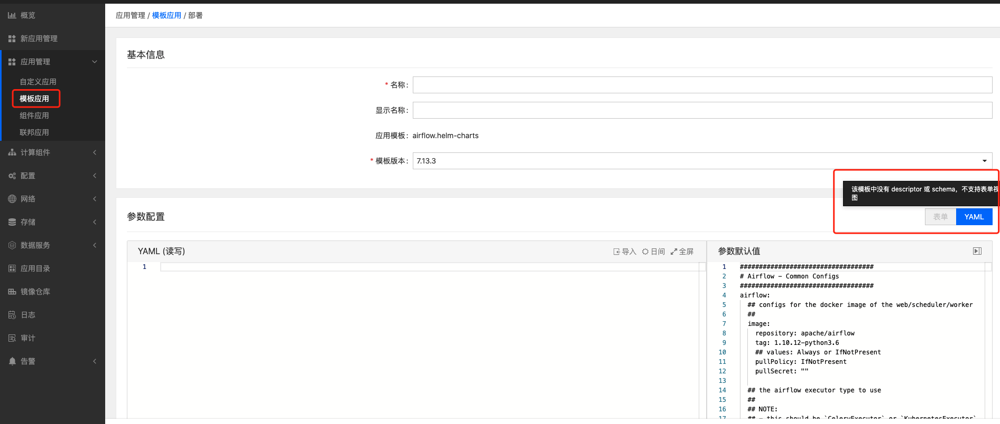

---
kind:
  - Troubleshooting
products:
  - Alauda Container Platform
  - Alauda DevOps
  - Alauda AI
  - Alauda Application Services
  - Alauda Service Mesh
  - Alauda Developer Portal
ProductsVersion:
  - 4.1.0,4.2.x
---
<!-- A type of document that involves encountering a fault, diagnosing it, performing root cause analysis, and providing solutions. -->

# helm模版报错不支持表单视图

helm模版报错不支持表单视图

## Cause
- helm charts中未包含schema.json文件

## Resolution
- 在helm charts中添加schema.json文件

## [workaround]

## [Related Information]
**Screenshots**

- Environment: 3.4.2
- schema.json
- Component: Helm
- Page ID: 101651582
- Original Title: helm模版报错不支持表单视图
