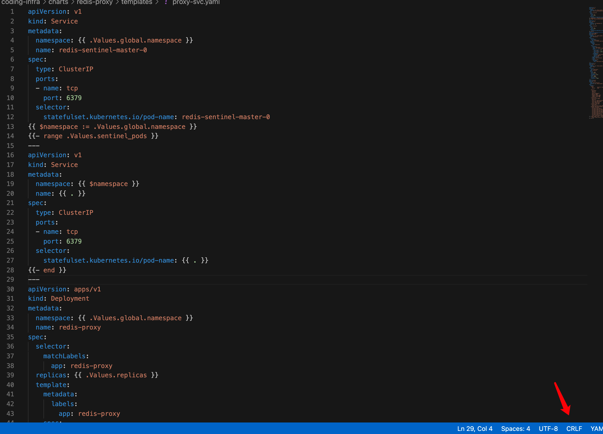
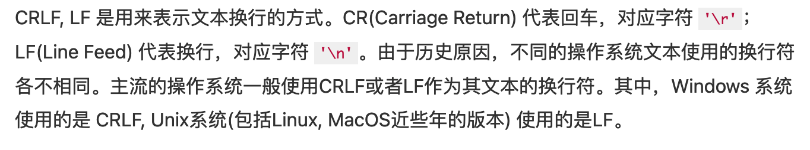

---
kind:
  - Troubleshooting
products:
  - Alauda Container Platform
  - Alauda DevOps
  - Alauda AI
  - Alauda Application Services
  - Alauda Service Mesh
  - Alauda Developer Portal
ProductsVersion:
  - 4.1.0,4.2.x
---
<!-- A type of document that involves encountering a fault, diagnosing it, performing root cause analysis, and providing solutions. -->

# 通过平台应用目录部署chart，服务创建不出来但是显示部署成功

部署显示成功但相关资源未创建 事件中没有服务创建或失败信息

## Cause
- YAML文件使用CRLF换行符导致资源分割失败

## Resolution
- 将文件换行符格式调整为LF
- 将yaml文件中的各资源分开文件编写

## [workaround]

## [Related Information]
**Screenshots**

- Environment: 包含应用目录模块版本
- ---分割符
- CRLF/LF换行符
- 应用目录模块
- captain组件
- annotation
- Component: Helm
- Page ID: 112040038
- Original Title: 通过平台应用目录部署chart，服务创建不出来但是显示部署成功
