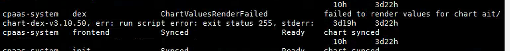

---
kind:
  - Troubleshooting
products:
  - Alauda Container Platform
  - Alauda DevOps
  - Alauda AI
  - Alauda Application Services
  - Alauda Service Mesh
  - Alauda Developer Portal
ProductsVersion:
  - 4.1.0,4.2.x
---
<!-- A type of document that involves encountering a fault, diagnosing it, performing root cause analysis, and providing solutions. -->

# 增加平台访问地址后平台处于部署中

平台状态始终处于部署中 ars状态同步异常，dex无法正常同步 sentry与base-operator日志报错: error="run script error: exit status 255, stderr"

## Cause
- configmaps资源中存在"helm.sh/resource-policy"注解导致同步异常
- 3.10.1版本存在该缺陷

## Resolution
- kubectl annotate -n cpaas-system cm ui-logos ui-login-logo ui-login-bg helm.sh/resource-policy-

## [workaround]

## [Related Information]
**Screenshots**

- Environment: 3.10.1
- ars
- dex
- sentry
- base-operator
- ui-logos
- ui-login-logo
- ui-login-bg
- helm.sh/resource-policy
- Component: Helm
- Page ID: 133075983
- Original Title: 增加平台访问地址后平台处于部署中
