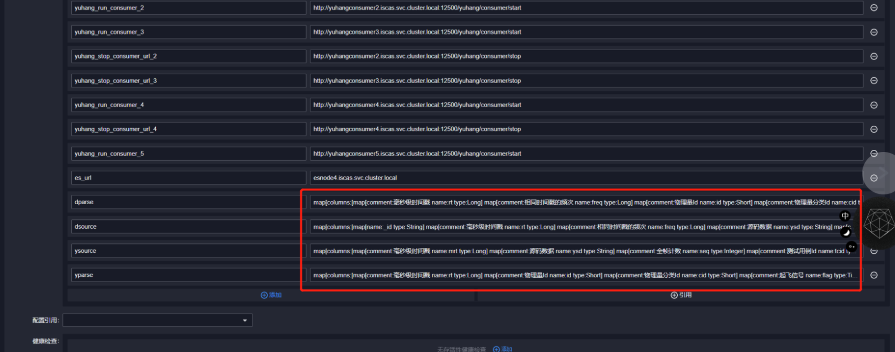
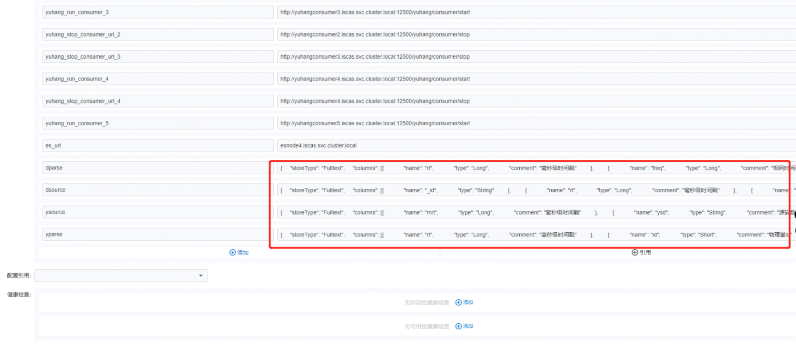

---
kind:
  - Troubleshooting
products:
  - Alauda Container Platform
  - Alauda DevOps
  - Alauda AI
  - Alauda Application Services
  - Alauda Service Mesh
  - Alauda Developer Portal
ProductsVersion:
  - 4.1.0,4.2.x
---
<!-- A type of document that involves encountering a fault, diagnosing it, performing root cause analysis, and providing solutions. -->

# 应用分发导入后创建新应用环境变量值发生改变

环境变量的值在创建新应用时发生变化

## Cause
- TKE 3.8版本未对chart values中的值进行转义处理
- helm未将未转义的值识别为json字符串

## Resolution
- 升级到TKE 3.10版本(已修复该问题)

## [workaround]
- 在创建应用时手动设置经过正确转义的values值

## [Related Information]
**Screenshots**

- Environment: TKE 3.8
- helm应用
- values.yaml
- 应用分发功能
- Component: Helm
- Page ID: 140806660
- Original Title: 应用分发导入后创建新应用环境变量值发生改变
