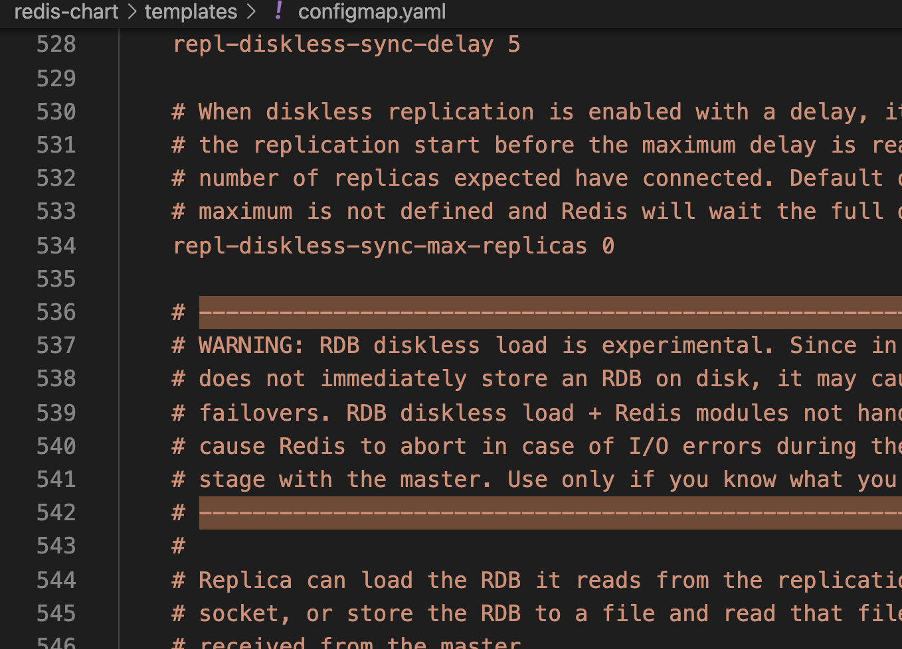

---
kind:
  - Troubleshooting
products:
  - Alauda Container Platform
  - Alauda DevOps
  - Alauda AI
  - Alauda Application Services
  - Alauda Service Mesh
  - Alauda Developer Portal
ProductsVersion:
  - 4.1.0,4.2.x
---
<!-- A type of document that involves encountering a fault, diagnosing it, performing root cause analysis, and providing solutions. -->

# 原生应用使用模版创建发现无关联资源

用模版（chart）部署的应用，部署完application无关联资源，但chart中的sts在集群里正常创建 archon-api中有相关日志 metis中有日志提示分割manifest失败

## Cause
- helmrequest分割manifest时使用的'---'与configmap注释中的'---------'产生冲突

## Resolution
- 删除configmap中出现的'---------'注释内容
- 将configmap中的'---------'替换为'======'

## [workaround]

## [Related Information]
**Screenshots**

- Environment: TKE 3.8.3
- helmrequest
- captain
- archon-api
- metis
- manifests分割符
- Component: Helm
- Page ID: 152657747
- Original Title: 原生应用使用模版创建发现无关联资源
