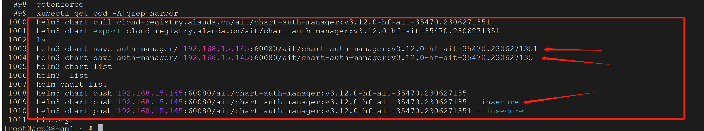
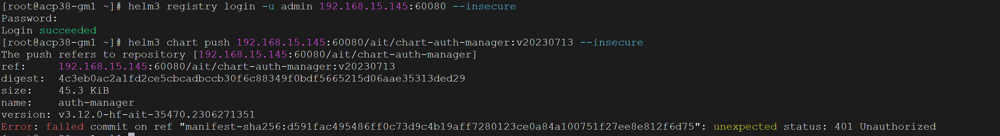
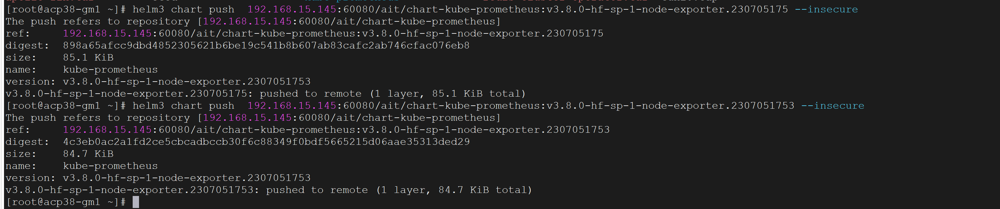
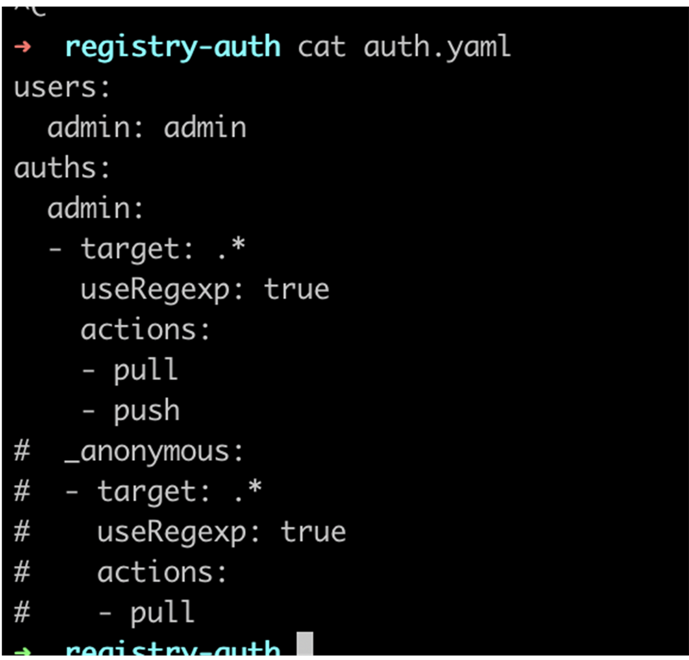

---
kind:
  - Troubleshooting
products:
  - Alauda Container Platform
  - Alauda DevOps
  - Alauda AI
  - Alauda Application Services
  - Alauda Service Mesh
  - Alauda Developer Portal
ProductsVersion:
  - 4.1.0,4.2.x
---
<!-- A type of document that involves encountering a fault, diagnosing it, performing root cause analysis, and providing solutions. -->

# 上传同一个chart镜像的多个tag失败

上传同一chart镜像的不同tag时返回401错误 其他chart镜像上传正常 登录认证正常

## Cause
- 当layer已存在时，helm在manifest上传阶段使用匿名用户执行写操作
- 匿名用户缺少写权限导致401错误

## Resolution
- 注释/etc/kubernetes/registry/auth.yaml中的_anonymous配置
- 重启registry服务

## [workaround]

## [Related Information]
**Screenshots**
4、login没有问题，尝试使用其他的chart镜像进行push测试，也可以传多个tag

- Environment: ACP 3.8/3.12版本，涉及chart镜像操作
- /etc/kubernetes/registry/auth.yaml
- registry
- _anonymous
- Component: Helm
- Page ID: 152658065
- Original Title: 上传同一个chart镜像的多个tag失败
