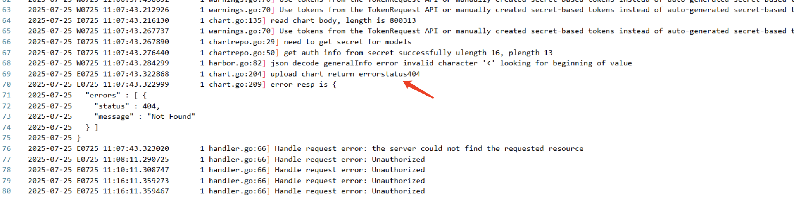

---
kind:
  - Troubleshooting
products:
  - Alauda Container Platform
  - Alauda DevOps
  - Alauda AI
  - Alauda Application Services
  - Alauda Service Mesh
  - Alauda Developer Portal
ProductsVersion:
  - 4.1.0,4.2.x
---
<!-- A type of document that involves encountering a fault, diagnosing it, performing root cause analysis, and providing solutions. -->

# 当前平台中的helm部署，不支持helm3.17的版本

使用Helm3.17打包的chart包在前端页面部署失败 前端上传chart压缩包报错 部署时子chart依赖渲染异常

## Cause
- 平台当前使用的Helm库版本不支持Helm3.17的chart包
- jfrog仓库返回构建失败导致上传异常

## Resolution
- 升级captain组件的Helm依赖库版本（需代码改造）
- 移除主chart中postgresql_ha子chart后重新打包部署

## [workaround]
- 通过后台命令行直接上传chart包到仓库
- 临时规避有问题的子chart依赖

## [Related Information]
**Screenshots**

- Environment: 3.14.2
- captain-controller-manager
- archon组件
- jfrog仓库
- postgresql_ha子chart
- Component: Helm
- Page ID: 323682759
- Original Title: 容器平台-应用管理-应用商店-当前平台中的helm部署，不支持helm3.17的版本-113524
