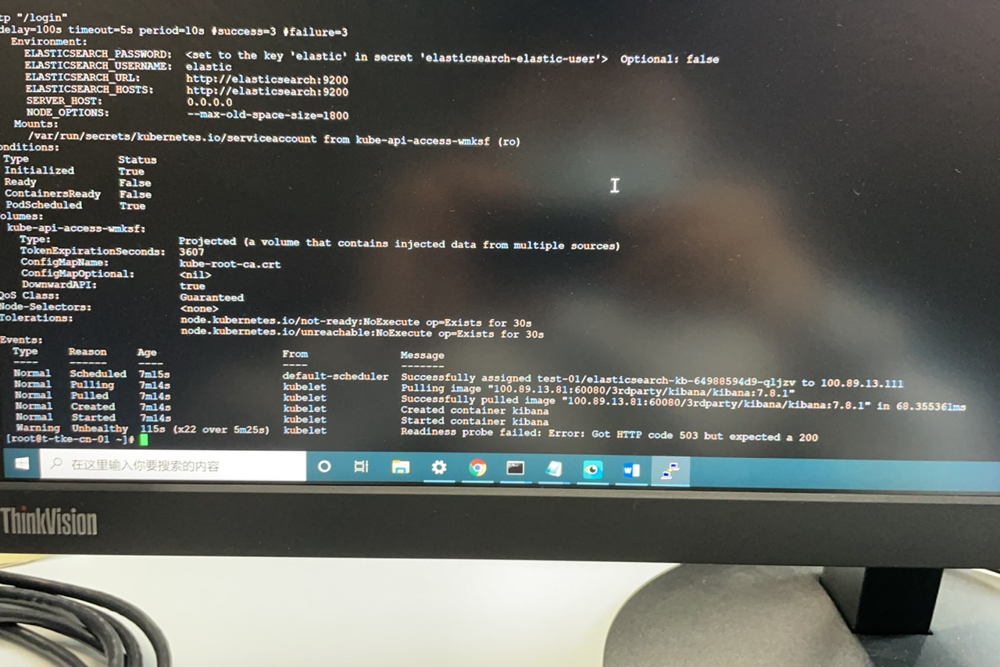
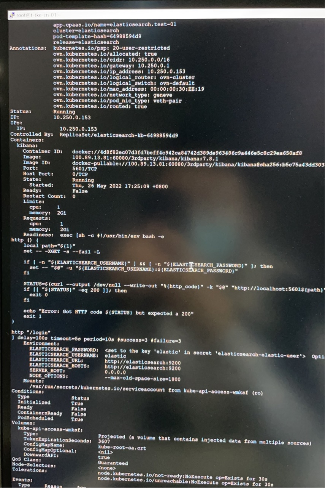
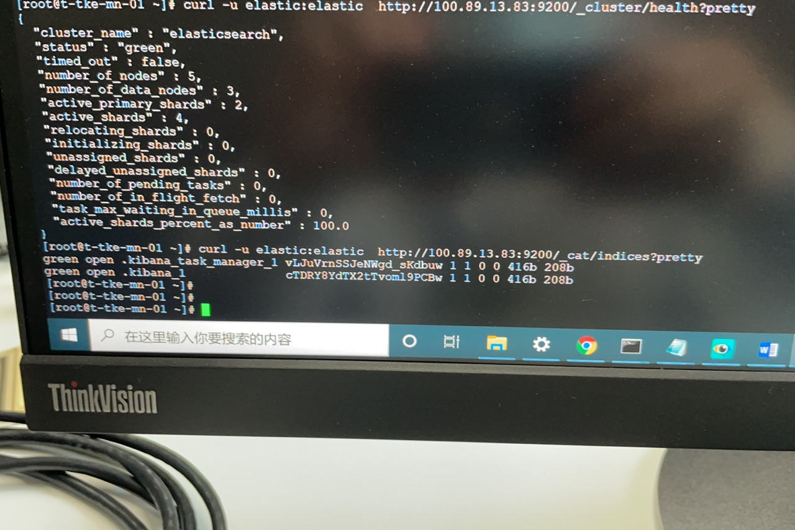

---
kind:
  - Troubleshooting
products:
  - Alauda Container Platform
  - Alauda DevOps
  - Alauda AI
  - Alauda Application Services
  - Alauda Service Mesh
  - Alauda Developer Portal
ProductsVersion:
  - 4.1.0,4.2.x
---
<!-- A type of document that involves encountering a fault, diagnosing it, performing root cause analysis, and providing solutions. -->

# 应用商店部署es无法查看kibana，报错kibana server is not ready yet

kibana容器状态为0/1 健康检查失败报错 访问kibana返回503错误

## Cause
- kibana索引异常导致健康检查失败

## Resolution
- 清理elasticsearch中.kibana*相关索引

## [workaround]

## [Related Information]
**Screenshots**

- Environment: 3.8.1
- 5601端口
- .kibana索引
- health_check配置
- Component: 应用商店
- Page ID: 115528369
- Original Title: 应用商店部署es无法查看kibana，报错kibana server is not ready yet
