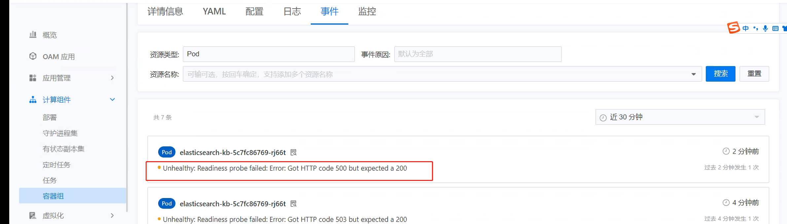

---
kind:
  - Troubleshooting
products:
  - Alauda Container Platform
  - Alauda DevOps
  - Alauda AI
  - Alauda Application Services
  - Alauda Service Mesh
  - Alauda Developer Portal
ProductsVersion:
  - 4.1.0,4.2.x
---
<!-- A type of document that involves encountering a fault, diagnosing it, performing root cause analysis, and providing solutions. -->

# 通过模板部署elasticsearch失败

elasticsearch-kb服务无法启动 服务日志无相关输出 存在两个kibana pod实例

## Cause
- 多个kibana实例导致服务启动失败

## Resolution

## [workaround]
- 通过「应用商店管理」部署（不生成应用信息）
- 在「应用商店」部署时将kibana实例数设置为0，待es集群就绪后调整为1

## [Related Information]
**Screenshots**

- Environment: 3.8.1
- kibana实例数配置
- 应用商店管理
- 应用商店部署配置
- Component: 应用商店
- Page ID: 115537911
- Original Title: 原生应用-通过模板部署elasticsearch失败
