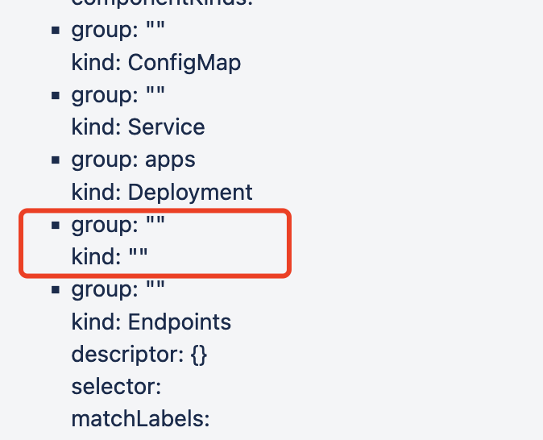
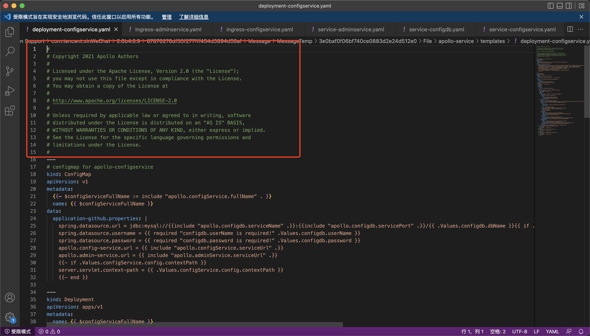

---
kind:
  - Troubleshooting
products:
  - Alauda Container Platform
  - Alauda DevOps
  - Alauda AI
  - Alauda Application Services
  - Alauda Service Mesh
  - Alauda Developer Portal
ProductsVersion:
  - 4.1.0,4.2.x
---
<!-- A type of document that involves encountering a fault, diagnosing it, performing root cause analysis, and providing solutions. -->

# 应用商店部署应用，自定义应用点击之后加载失败

自定义应用页面点进去之后加载失败 应用状态显示正常

## Cause
- application yaml中存在多余字段
- yaml文件存在全注释无内容的情况
- yaml注释中包含---符号

## Resolution
- 删除application yaml中指定字段
- 清理无内容的纯注释yaml文件
- 移除包含---符号的注释

## [workaround]

## [Related Information]
**Screenshots**

- Environment: 3.4.2
- application.yaml
- chart文件中的yaml
- ---符号
- Component: 应用商店
- Page ID: 120126267
- Original Title: 应用商店部署应用，自定义应用点击之后加载失败
