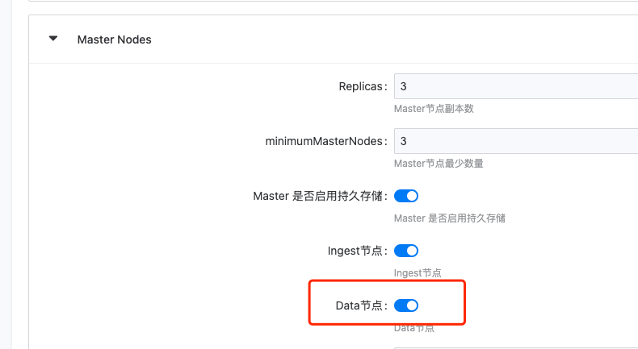

---
kind:
  - Troubleshooting
products:
  - Alauda Container Platform
  - Alauda DevOps
  - Alauda AI
  - Alauda Application Services
  - Alauda Service Mesh
  - Alauda Developer Portal
ProductsVersion:
  - 4.1.0,4.2.x
---
<!-- A type of document that involves encountering a fault, diagnosing it, performing root cause analysis, and providing solutions. -->

# 应用商店es启动失败

Elasticsearch exception [type=unavailable_shards_exception, reason=[server_][0] primary shard is not active kafka提示：java.util.concurrent.TimeoutException: null at org.apache.kafka.common.internals.KafkaFutureImpl$SingleWaiter.await(KafkaFutureImpl.java:108) at com.sobey.jcg.sobeycloud.commons.jms.kafka.CustomKafkaTemplate.createTopic(CustomKafkaTemplate.java:120)

## Cause
- es关闭了data node，master节点未开启数据节点

## Resolution
- 确保es集群中data node正确启动，并配置master节点允许存储数据

## [workaround]

## [Related Information]
**Screenshots**

- Environment: TKE 3.8
- Elasticsearch data node配置
- node.master/node.data参数
- CustomKafkaTemplate.createTopic
- KafkaFutureImpl
- Component: 应用商店
- Page ID: 124687425
- Original Title: 应用商店es启动失败
