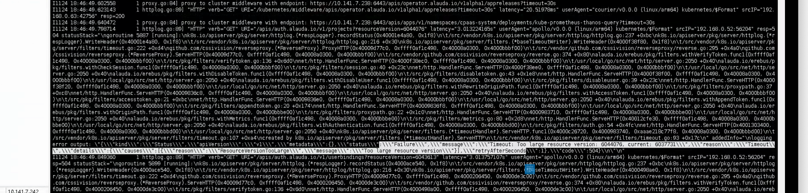
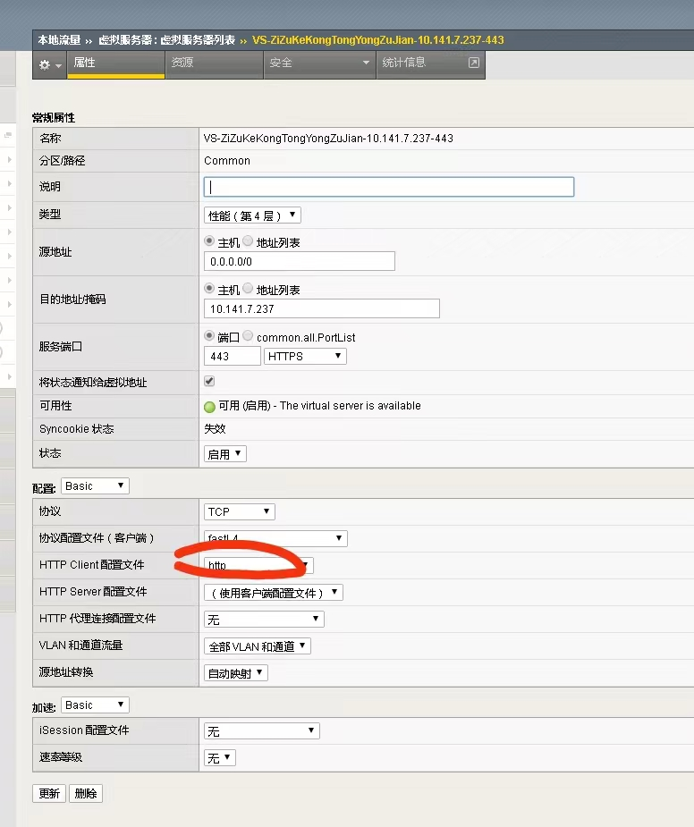

---
kind:
  - Troubleshooting
products:
  - Alauda Container Platform
  - Alauda DevOps
  - Alauda AI
  - Alauda Application Services
  - Alauda Service Mesh
  - Alauda Developer Portal
ProductsVersion:
  - 4.1.0,4.2.x
---
<!-- A type of document that involves encountering a fault, diagnosing it, performing root cause analysis, and providing solutions. -->

# 应用商店无法加载出来可用chart

应用商店接口报错500 请求的version参数值异常大 请求返回504超时

## Cause
- F5负载均衡器配置问题

## Resolution
- 取消F5负载均衡器中的相关配置

## [workaround]

## [Related Information]
**Screenshots**

- Environment: 3.8
- erebus
- etcd
- F5
- 应用商店接口
- Component: 应用商店
- Page ID: 130576407
- Original Title: 容器平台-应用商店无法加载出来可用chart
