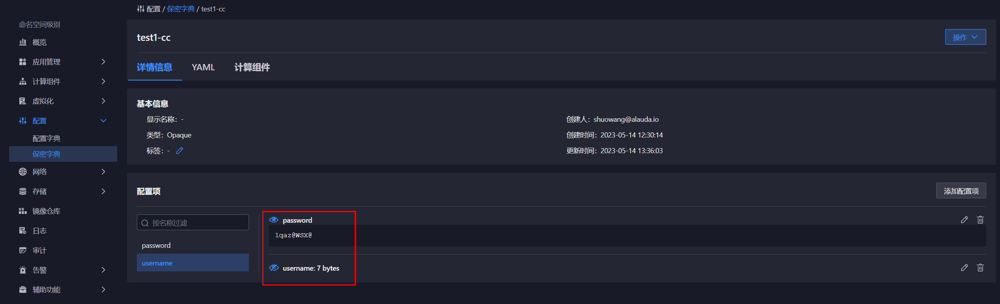

---
kind:
  - Troubleshooting
products:
  - Alauda Container Platform
  - Alauda DevOps
  - Alauda AI
  - Alauda Application Services
  - Alauda Service Mesh
  - Alauda Developer Portal
ProductsVersion:
  - 4.1.0,4.2.x
---
<!-- A type of document that involves encountering a fault, diagnosing it, performing root cause analysis, and providing solutions. -->

# 应用商店es密码更新方式

401提示 集群状态不健康

## Cause
- ES密码变更未生效
- 未正确更新加密字典

## Resolution
- 检查命名空间加密字典获取当前ES认证信息
- 执行curl -u 用户名:密码 'http://localhost:9200/_cluster/health?pretty'验证服务状态
- 通过平台更新ES加密字典内容
- 在应用界面重启ES服务并等待Pod就绪
- 使用curl -u 用户名:新密码 'http://localhost:9200/_cluster/health?pretty'验证新密码

## [workaround]

## [Related Information]
**Screenshots**

- Environment: 通用
- 加密字典(Secret)
- 9200端口
- /_cluster/health接口
- ES服务Pod
- Component: 应用商店
- Page ID: 146364989
- Original Title: 应用商店es密码更新方式
