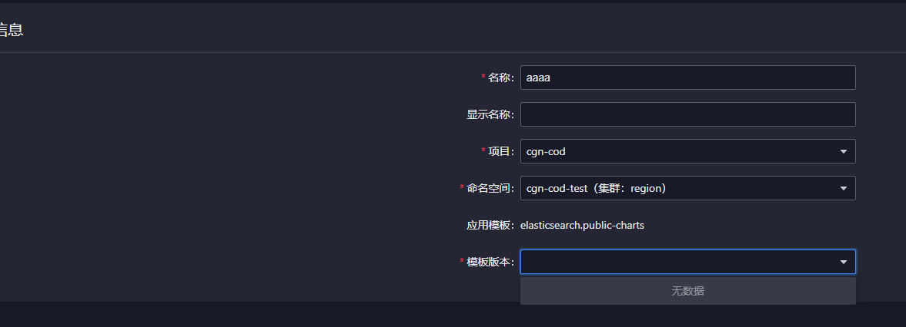
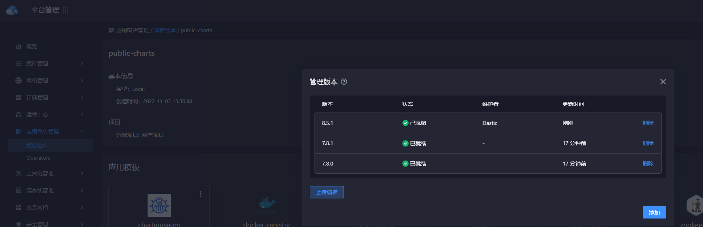

---
kind:
  - Troubleshooting
products:
  - Alauda Container Platform
  - Alauda DevOps
  - Alauda AI
  - Alauda Application Services
  - Alauda Service Mesh
  - Alauda Developer Portal
ProductsVersion:
  - 4.1.0,4.2.x
---
<!-- A type of document that involves encountering a fault, diagnosing it, performing root cause analysis, and providing solutions. -->

# 3.8

模版仓库界面上传新的版本后，应用商店部署模板列表无对应版本

## Cause
- 上传的chart包非双架构内容
- 业务集群为arm架构

## Resolution
- 在模板详情页面手动设置arm架构标签

## [workaround]

## [Related Information]
**Screenshots**

- Environment: 3.8
- chart包架构支持标签
- 集群架构类型
- 应用商店部署模板列表
- 部署版本选择API
- Component: 应用商店
- Page ID: 172526057
- Original Title: 3.8-模版仓库界面上传新的版本后，应用商店部署模板列表无对应版本
