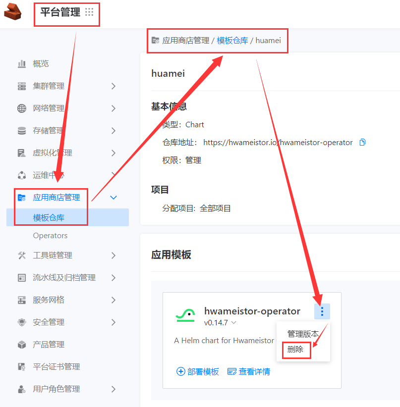
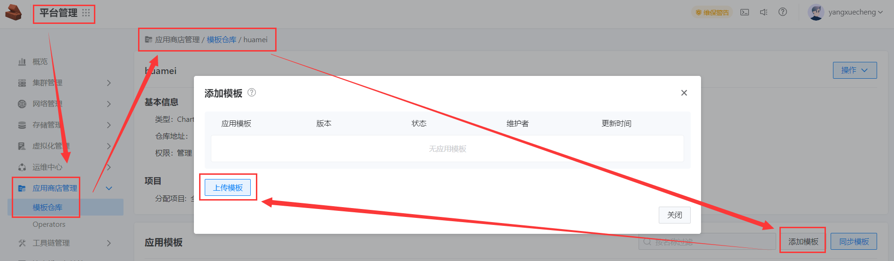
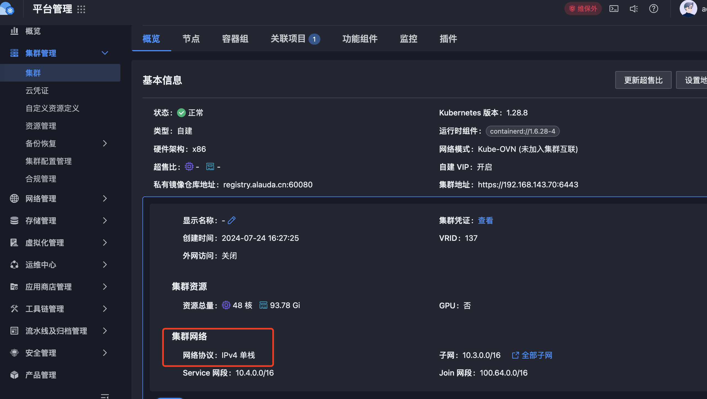

---
kind:
  - Troubleshooting
products:
  - Alauda Container Platform
  - Alauda DevOps
  - Alauda AI
  - Alauda Application Services
  - Alauda Service Mesh
  - Alauda Developer Portal
ProductsVersion:
  - 4.1.0,4.2.x
---
<!-- A type of document that involves encountering a fault, diagnosing it, performing root cause analysis, and providing solutions. -->

# 应用商店管理

应用商店无法识别arm64架构的应用包 部署时无法选择该模板或模板版本

## Cause
- 应用商店通过Chart.yaml的annotations字段识别架构支持

## Resolution
- 修改Chart.yaml添加annotations: cpaas.io/arch: amd64.arm64
- 执行helm package重新打包应用
- 删除旧应用包并上传新应用包

## [workaround]

## [Related Information]
**Screenshots**

- Environment: 版本 >3.16 且 <3.16
- Chart.yaml
- cpaas.io/arch
- cpaas.io/protocol-stack
- helm package
- Component: 应用商店
- Page ID: 224659586
- Original Title: 应用商店管理-模板仓库：arm64集群无法识别应用包
