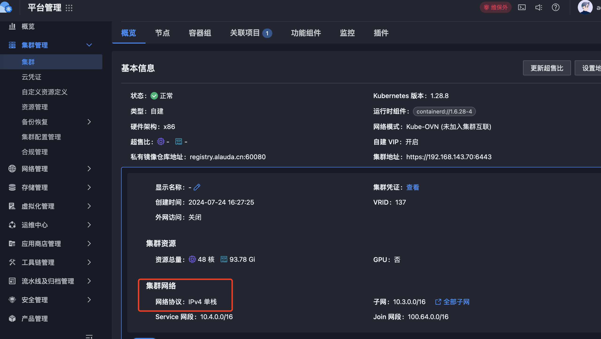

---
kind:
  - Troubleshooting
products:
  - Alauda Container Platform
  - Alauda DevOps
  - Alauda AI
  - Alauda Application Services
  - Alauda Service Mesh
  - Alauda Developer Portal
ProductsVersion:
  - 4.1.0,4.2.x
---
<!-- A type of document that involves encountering a fault, diagnosing it, performing root cause analysis, and providing solutions. -->

# 应用商店管理

JIRA Jira：

## Cause

## Resolution
- 在Chart.yaml的annotations中添加架构支持：
annotations:
  cpaas.io/arch: amd64.arm64
- 在Chart.yaml的annotations中添加网络栈支持：
annotations:
  cpaas.io/protocol-stack: IPv4

## [workaround]

## [Related Information]
**Screenshots**

- Environment: 大于、小于、等于 3.16
- cpaas.io/arch
- cpaas.io/protocol-stack
- Chart.yaml
- Component: 应用商店
- Page ID: 224659591
- Original Title: 应用商店管理-模板仓库：应用包的Chart.yaml的annotations段使用说明
