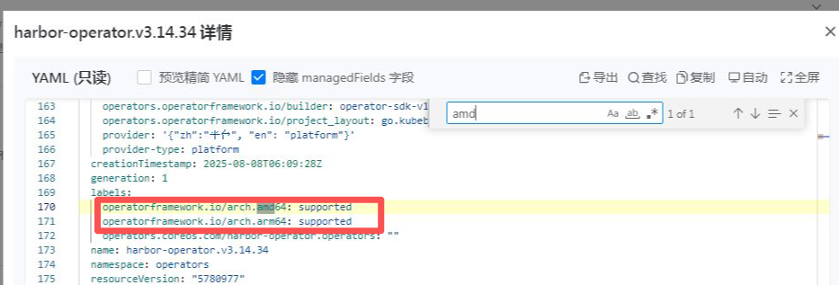

---
kind:
  - Troubleshooting
products:
  - Alauda Container Platform
  - Alauda DevOps
  - Alauda AI
  - Alauda Application Services
  - Alauda Service Mesh
  - Alauda Developer Portal
ProductsVersion:
  - 4.1.0,4.2.x
---
<!-- A type of document that involves encountering a fault, diagnosing it, performing root cause analysis, and providing solutions. -->

# 使用violet推送operator制品包界面应用商店未展示问题排查

在 arm 业务集群的应用商店中无法查看到上架应用，而在 x86 业务集群中可正常查看

## Cause
- 应用包的打包信息与集群架构不匹配，csv 资源源码中设置的架构标签为 x86，导致 PackageManifest 资源识别的架构信息与集群匹配失败

## Resolution
- 在程序的 csv 资源源码中设置 operatorframework.io 架构标签，例如添加 arm 架构标签
- 重新打包制品包并执行推送、创建 PackageManifest、Artifact、Artifactversion 等操作，删除旧 PackageManifest 资源并重新创建

## [workaround]

## [Related Information]
**Screenshots**
，
- Environment: Alauda Container Platform <3.18
- PackageManifest
- Artifact
- Artifactversion
- operatorframework.io 架构标签
- Component: 应用商店
- Page ID: 336396908
- Original Title: 容器平台-使用violet推送operator制品包界面应用商店未展示问题排查-116062
