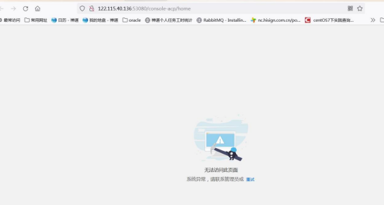
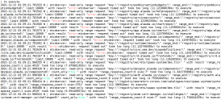
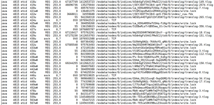
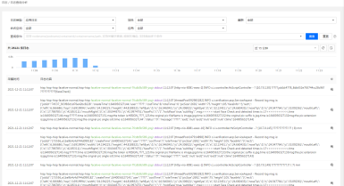

---
kind:
  - Troubleshooting
products:
  - Alauda Container Platform
  - Alauda DevOps
  - Alauda AI
  - Alauda Application Services
  - Alauda Service Mesh
  - Alauda Developer Portal
ProductsVersion:
  - 4.1.0,4.2.x
---
<!-- A type of document that involves encountering a fault, diagnosing it, performing root cause analysis, and providing solutions. -->

# 平台页面无法登陆

云平台页面登录报错无法访问 部分平台组件处于crash状态 执行k8s命令卡顿并报错"Error from server: etcdserver: request timed out"

## Cause
- 磁盘性能不足导致etcd读写数据延迟

## Resolution
- 提升磁盘性能以根本解决问题

## [workaround]
- 临时停用es/kafka/zookeeper/lanaya组件
- 调整管理集群日志收集范围及存储时间
- 清理历史日志数据

## [Related Information]
**Screenshots**
云平台页面登录报错无法访问，后台查看部分平台组件处于crash状态。
1. 登录管理集群master节点后台主机，执行k8s命令查看节点情况发现发现卡顿，并且报错“Error from server: etcdserver: request timed out”，查看etcd容器日志发现大量“too too long(11s)”报错
2. 在主机/var/lib/etcd目录下执行命令dd if=/dev/zero bs=4k count=10k of=./test oflag=direct；dd if=./test of=/dev/null bs=4k count=10000 iflag=direct测试磁盘读写情况
采取临时恢复办法，top命令查看主机负载情况，发现由于磁盘性能差，etcd读写数据慢，es的java进程消耗cpu和内存较多，
停掉es/kafka/zookeeper/lanaya组件后，平台组件恢复正常，页面查看功能正常；调整管理集群日志收集范围，调整减短日志存储时间，清理之前的日志数据后启动es/kafka/zookeeper/lanaya组件，日志功能恢复正常，但是运行一段时间后，日志数据出现延迟，重新dd测试etcd数据磁盘读写发现速度降低到400K/s左右，上述办法无法根本解决问题，需要解决磁盘性能问题。
- Environment: 3.6.1
- etcd
- es
- kafka
- zookeeper
- lanaya
- /var/lib/etcd
- dd if=/dev/zero bs=4k count=10k of=./test oflag=direct
- dd if=./test of=/dev/null bs=4k count=10000 iflag=direct
- Component: ETCD
- Page ID: 101652111
- Original Title: 基础架构-平台页面无法登陆
