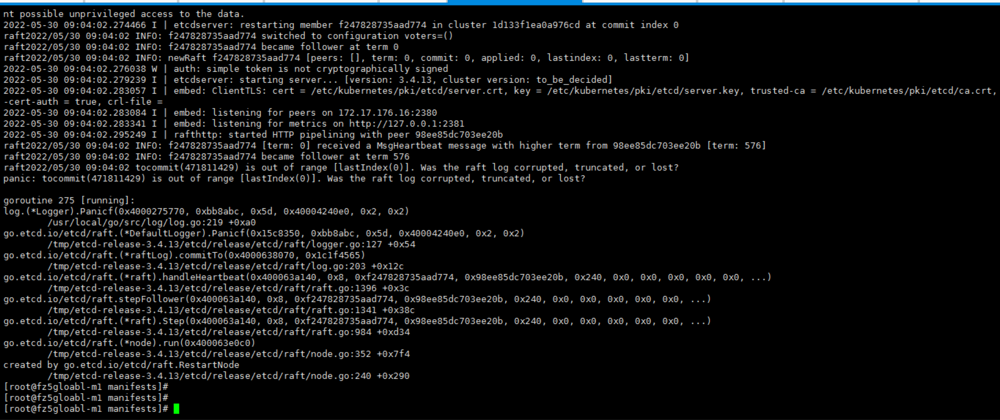

---
kind:
  - Troubleshooting
products:
  - Alauda Container Platform
  - Alauda DevOps
  - Alauda AI
  - Alauda Application Services
  - Alauda Service Mesh
  - Alauda Developer Portal
ProductsVersion:
  - 4.1.0,4.2.x
---
<!-- A type of document that involves encountering a fault, diagnosing it, performing root cause analysis, and providing solutions. -->

# etcd集群异常，报错tocommit (471811429) is out of range (lastIndex(0)]. Was the raft log corrupted, truncated, or lost?

etcd无法启动，报错tocommit (471811429) is out of range (lastIndex(0)]. Was the raft log corrupted, truncated, or lost? /var/lib/etcd目录大小与其他节点不一致

## Cause
- etcd数据损坏

## Resolution
- 停止kubelet服务并清理异常节点数据
- 从etcd集群中移除故障节点
- 重新添加节点并启动etcd容器同步数据

## [workaround]

## [Related Information]
**Screenshots**

- Environment: 通用
- /var/lib/etcd
- /etc/kubernetes/manifest/etcd.yaml
- /etc/kubernetes/pki/etcd/ca.crt
- /etc/kubernetes/pki/etcd/server.crt
- /etc/kubernetes/pki/etcd/server.key
- 2379
- 2380
- etcdctl
- Component: ETCD
- Page ID: 115528352
- Original Title: etcd集群异常，报错tocommit (471811429) is out of range (lastIndex(0)]. Was the raft log corrupted, truncated, or lost?
