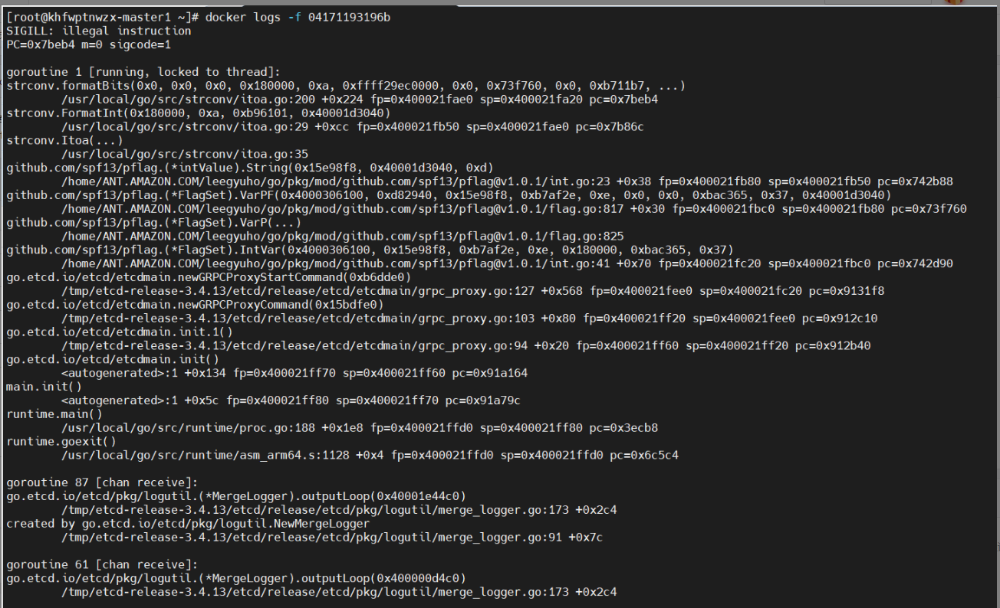

---
kind:
  - Troubleshooting
products:
  - Alauda Container Platform
  - Alauda DevOps
  - Alauda AI
  - Alauda Application Services
  - Alauda Service Mesh
  - Alauda Developer Portal
ProductsVersion:
  - 4.1.0,4.2.x
---
<!-- A type of document that involves encountering a fault, diagnosing it, performing root cause analysis, and providing solutions. -->

# etcd报错illegal instruction

etcd启动报错illegal instruction 移除etcd并重新加入集群后问题依旧 宿主机直接运行etcd二进制文件无报错

## Cause
- etcd镜像存在兼容性问题

## Resolution
- 删除etcd镜像并重启kubelet重新拉取镜像

## [workaround]

## [Related Information]
**Screenshots**

- Environment: Kubernetes/容器化环境
- etcd镜像
- kubelet
- etcd二进制文件
- Component: ETCD
- Page ID: 115536841
- Original Title: etcd报错illegal instruction
