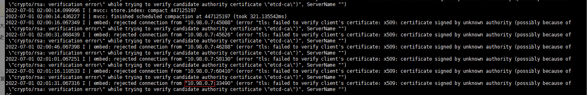

---
kind:
  - Troubleshooting
products:
  - Alauda Container Platform
  - Alauda DevOps
  - Alauda AI
  - Alauda Application Services
  - Alauda Service Mesh
  - Alauda Developer Portal
ProductsVersion:
  - 4.1.0,4.2.x
---
<!-- A type of document that involves encountering a fault, diagnosing it, performing root cause analysis, and providing solutions. -->

# etcd日志报错证书认证失败x509: certiticate signed by unknown authority

etcd监控显示UP的只有2个 etcd日志报错x509: certiticate signed by unknown authority

## Cause
- etcd节点使用的证书与etcd-ca secret不一致

## Resolution
- 更新使用最新的etcd-ca证书

## [workaround]

## [Related Information]
**Screenshots**

- Environment: 通用
- etcd-ca
- secret
- prometheus容器
- Component: ETCD
- Page ID: 119087541
- Original Title: etcd日志报错证书认证失败x509: certiticate signed by unknown authority
