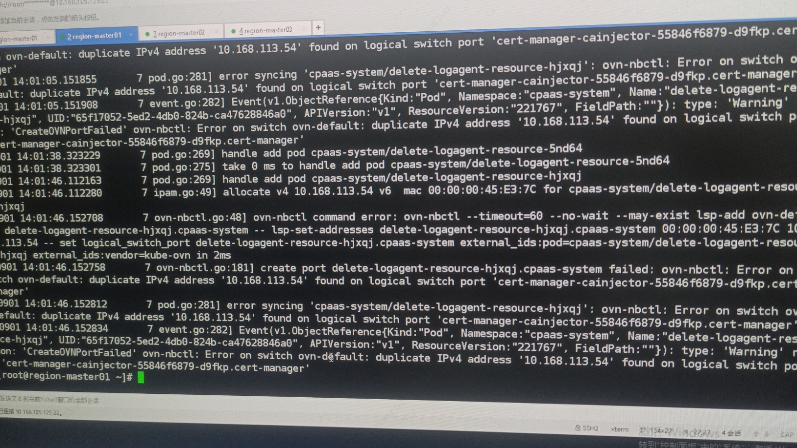
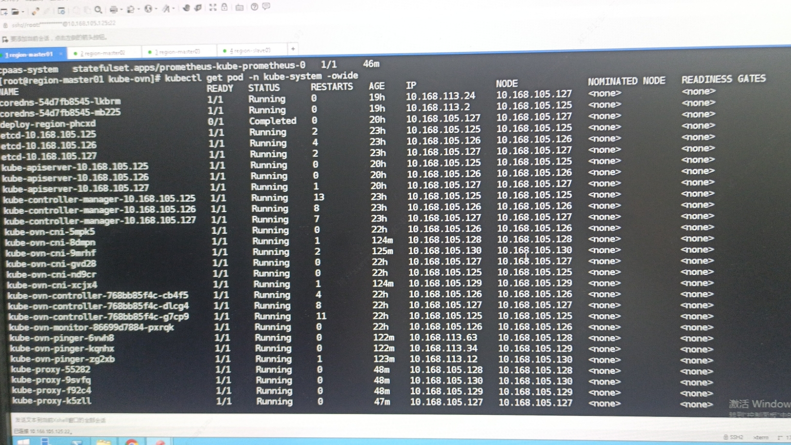
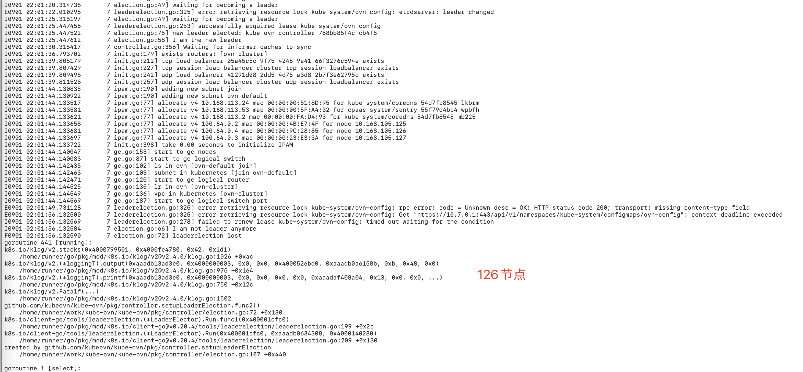
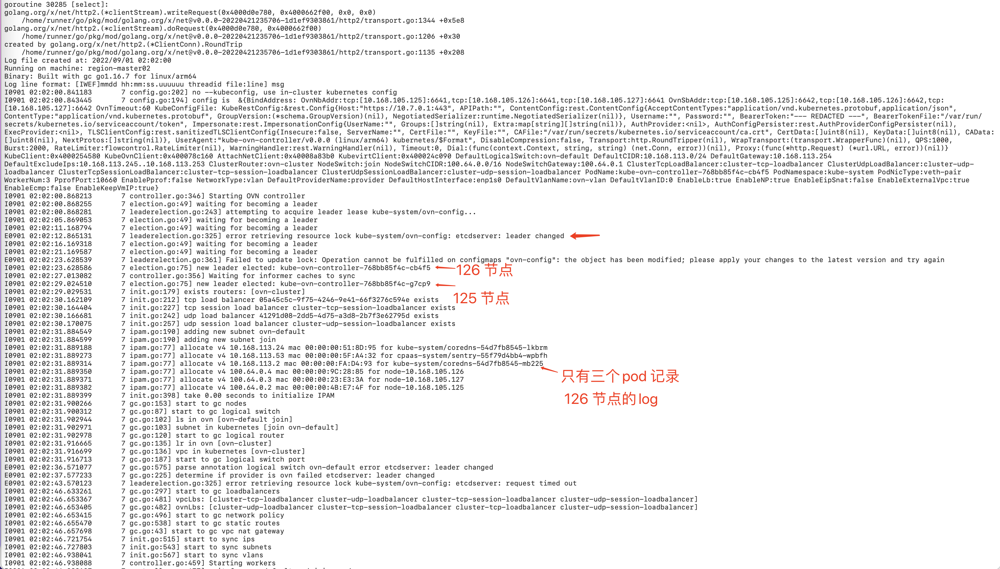
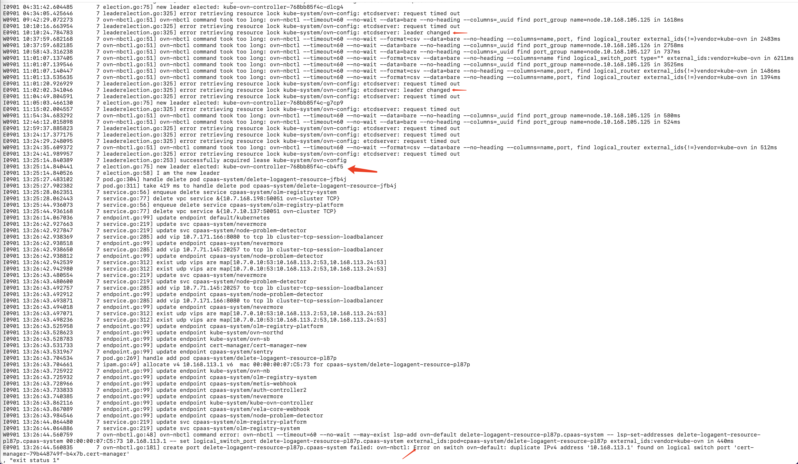
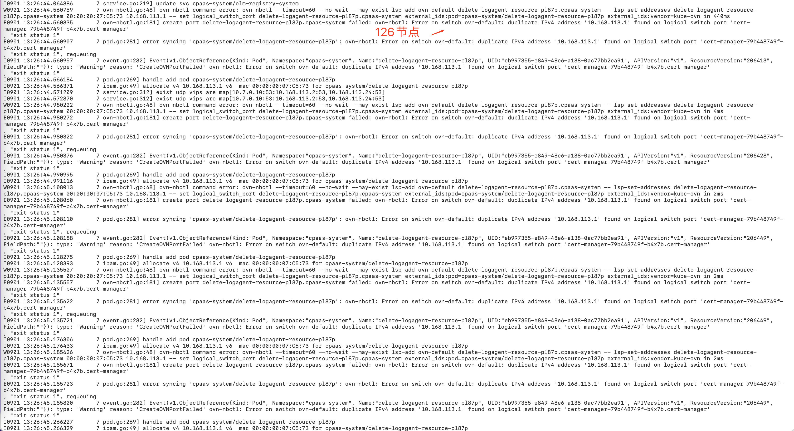
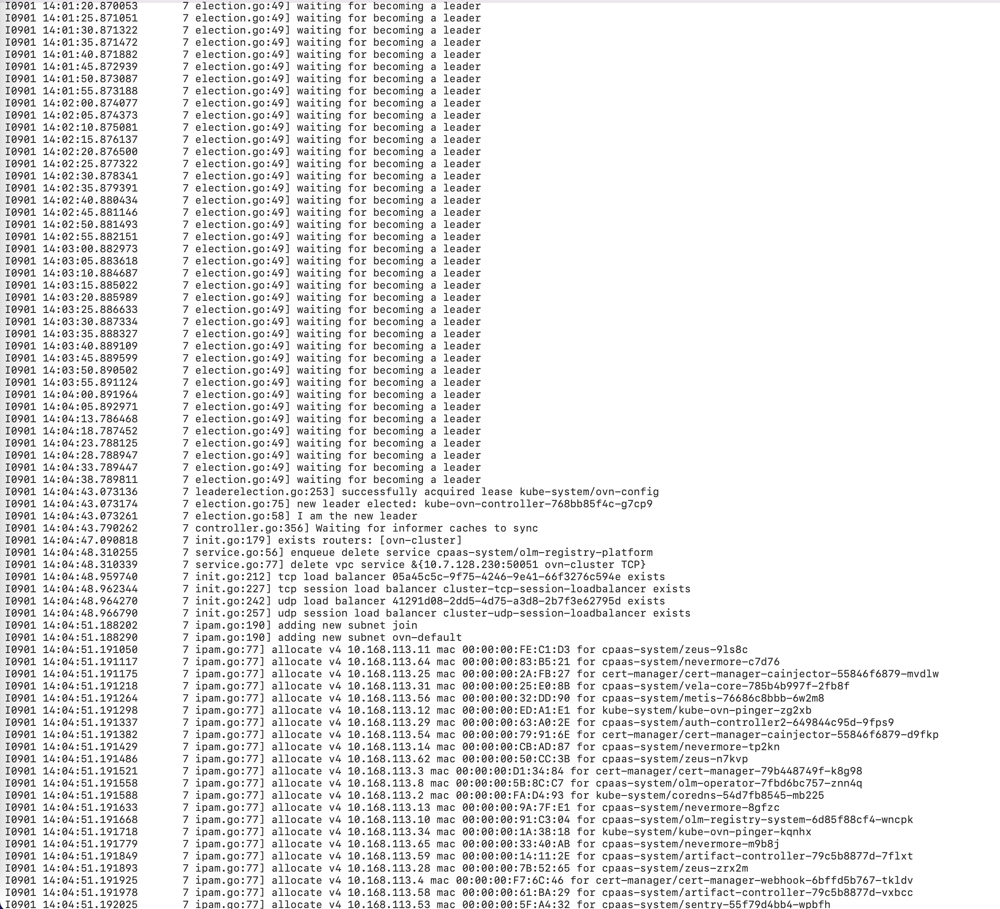
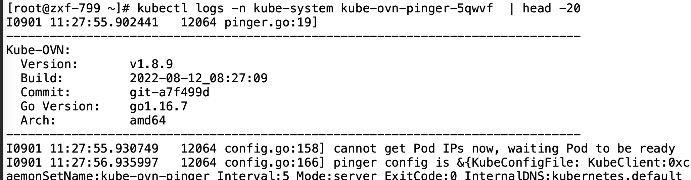
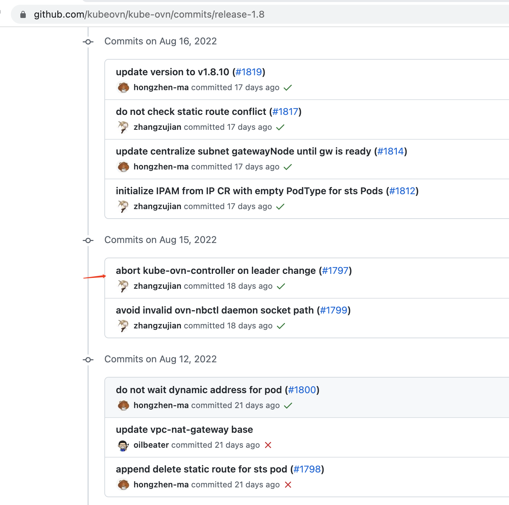

---
kind:
  - Troubleshooting
products:
  - Alauda Container Platform
  - Alauda DevOps
  - Alauda AI
  - Alauda Application Services
  - Alauda Service Mesh
  - Alauda Developer Portal
ProductsVersion:
  - 4.1.0,4.2.x
---
<!-- A type of document that involves encountering a fault, diagnosing it, performing root cause analysis, and providing solutions. -->

# 2022

节点和pod不同vlan导致网关探测失败 新加网卡使用pod网段地址导致IP冲突 集群中出现大量IP地址冲突

## Cause
- 节点与pod网段网关不通
- 未将已用IP加入subnet.spec.excludeIPs
- kube-ovn-controller选主时etcd存储不稳定

## Resolution
- 删除冲突pod重新分配地址

## [workaround]
- 将已用IP加入subnet.spec.excludeIPs

## [Related Information]
**Screenshots**

- Environment: ACP 3.8.2 underlay环境，CNI 1.8.9
- kube-ovn-controller
- subnet.spec.excludeIPs
- etcd存储
- Component: ETCD
- Page ID: 124687097
- Original Title: 2022-09-01 国泰君安证券，IP地址冲突问题
