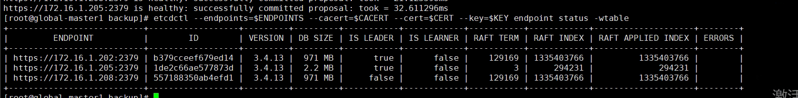

---
kind:
  - Troubleshooting
products:
  - Alauda Container Platform
  - Alauda DevOps
  - Alauda AI
  - Alauda Application Services
  - Alauda Service Mesh
  - Alauda Developer Portal
ProductsVersion:
  - 4.1.0,4.2.x
---
<!-- A type of document that involves encountering a fault, diagnosing it, performing root cause analysis, and providing solutions. -->

# 3.6.2

kubectl get nodes only returns a few nodes No pod resources in namespaces

## Cause
- One master node's etcd data size is 2.2M (normal: ~900M)
- Inconsistent etcd member ID compared to other nodes

## Resolution
- Modify /etc/etcd/etcd.yaml: set initial-cluster with three etcd node IPs and initial-cluster-state=existing
- rm -rf /var/lib/etcd
- Restart etcd container

## [workaround]

## [Related Information]
**Screenshots**
2、检查etcd集群状态，发现一个master节点etcd数据大小为2.2M，正常节点900M左右，ID也和其他两个节点不统一
- Environment: 3.6.2
- etcd
- etcd.yaml
- /var/lib/etcd
- initial-cluster
- initial-cluster-state
- Component: ETCD
- Page ID: 124696695
- Original Title: 3.6.2-基础架构-global集群无法正常显示节点和pod情况
