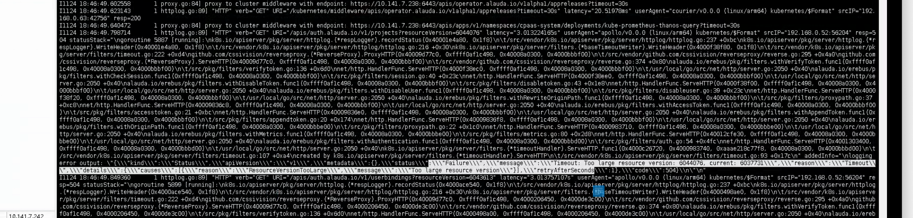
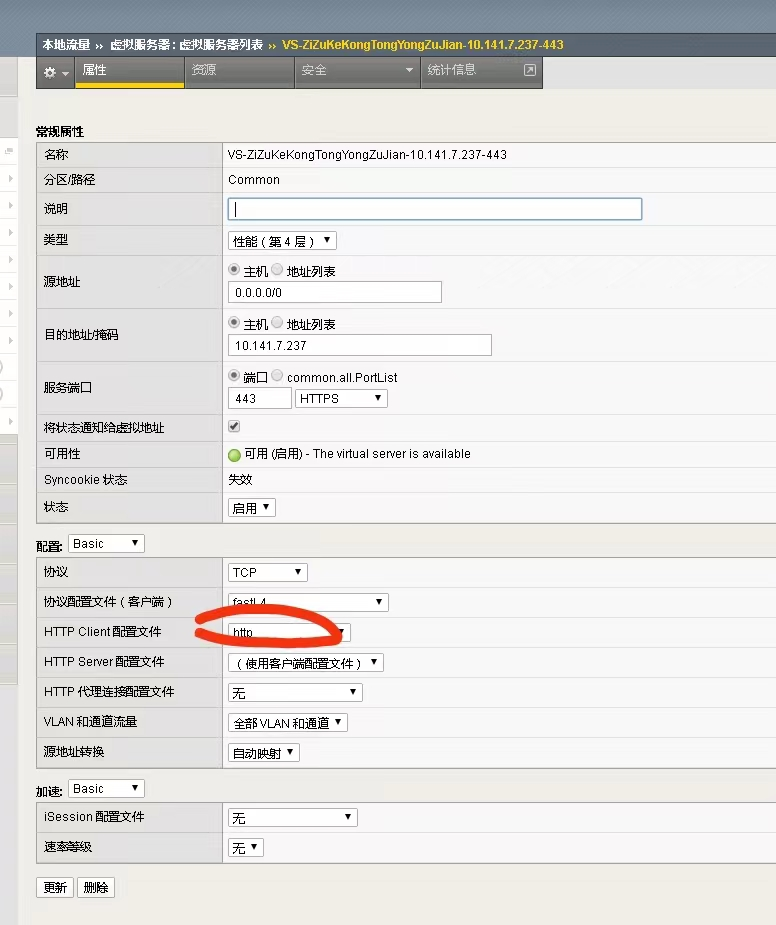

---
kind:
  - Troubleshooting
products:
  - Alauda Container Platform
  - Alauda DevOps
  - Alauda AI
  - Alauda Application Services
  - Alauda Service Mesh
  - Alauda Developer Portal
ProductsVersion:
  - 4.1.0,4.2.x
---
<!-- A type of document that involves encountering a fault, diagnosing it, performing root cause analysis, and providing solutions. -->

# 更换平台logo接口报错504

更换logo接口长时间无响应后返回504 请求的version值特别大

## Cause
- F5配置问题

## Resolution
- 取消F5相关配置

## [workaround]

## [Related Information]
**Screenshots**

- Environment: 3.8
- erebus
- etcd
- F5
- Component: ETCD
- Page ID: 130576396
- Original Title: 容器平台-更换平台logo接口报错504
