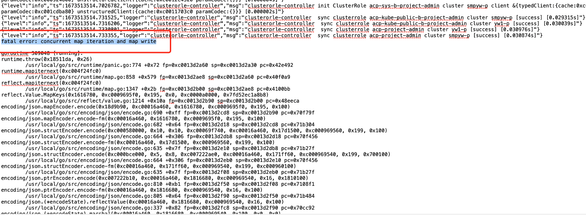

---
kind:
  - Troubleshooting
products:
  - Alauda Container Platform
  - Alauda DevOps
  - Alauda AI
  - Alauda Application Services
  - Alauda Service Mesh
  - Alauda Developer Portal
ProductsVersion:
  - 4.1.0,4.2.x
---
<!-- A type of document that involves encountering a fault, diagnosing it, performing root cause analysis, and providing solutions. -->

# auth

auth-controller2组件经常重启 fatal error: concurrent map iteration and map write

## Cause
- 高并发下golang map读写问题
- etcd选主频繁触发此问题

## Resolution

## [workaround]

## [Related Information]
**Screenshots**

- Environment: 3.6.1
- etcd
- Component: ETCD
- Page ID: 136528348
- Original Title: auth-controller2组件经常重启
