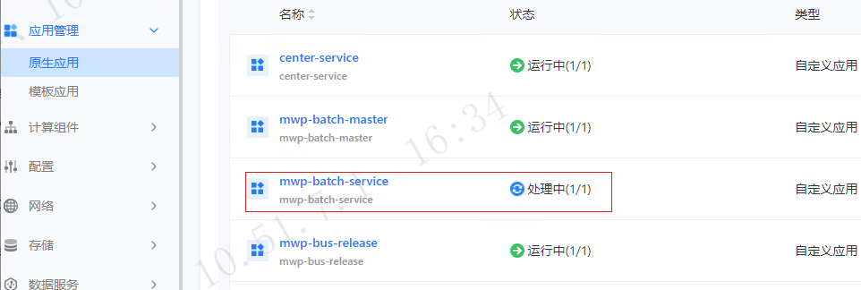
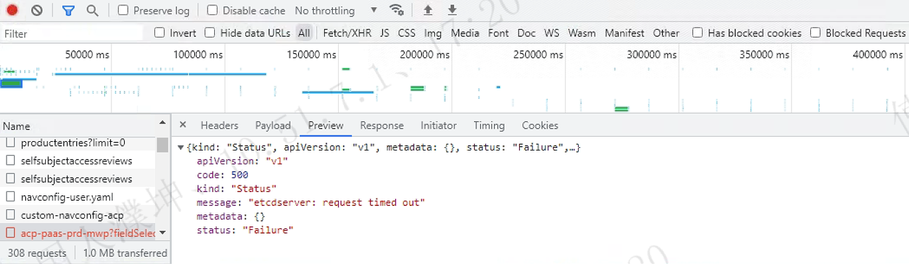
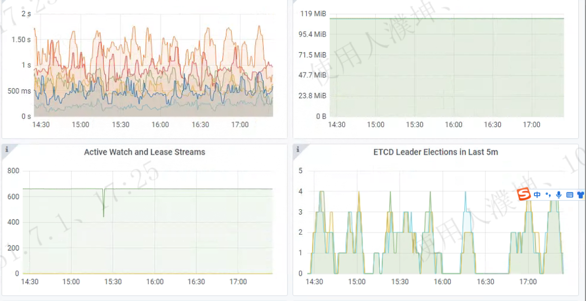
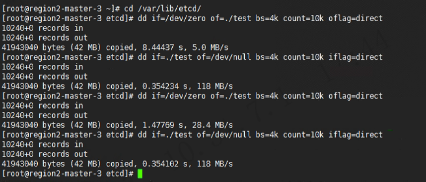
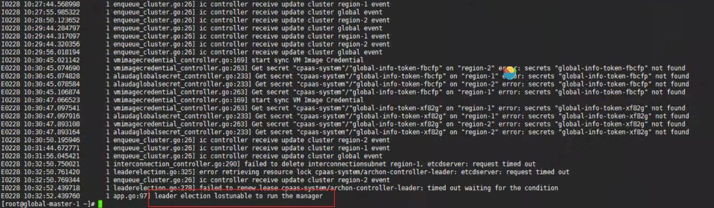

---
kind:
  - Troubleshooting
products:
  - Alauda Container Platform
  - Alauda DevOps
  - Alauda AI
  - Alauda Application Services
  - Alauda Service Mesh
  - Alauda Developer Portal
ProductsVersion:
  - 4.1.0,4.2.x
---
<!-- A type of document that involves encountering a fault, diagnosing it, performing root cause analysis, and providing solutions. -->

# 应用重启后界面状态一直处理中

前端请求返回500错误(连接etcd timeout) 应用界面状态持续显示处理中 etcd集群频繁选主

## Cause
- etcd磁盘性能不稳定导致频繁选主
- etcd切主导致archon组件数据状态与实际不一致

## Resolution
- 通过界面点击更新应用(不修改配置原地更新)触发数据重新获取

## [workaround]

## [Related Information]
**Screenshots**
查看archon组件日志发现信息

- Environment: 3.8.1
- etcd
- archon
- metis
- Component: ETCD
- Page ID: 140823346
- Original Title: 应用重启后界面状态一直处理中
