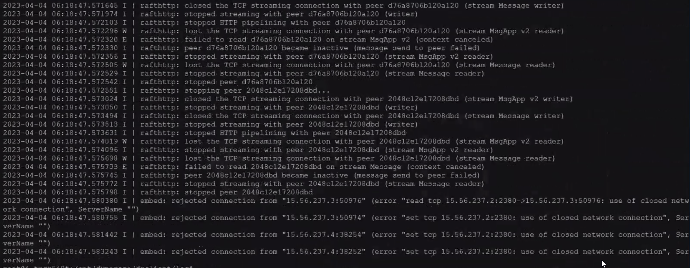
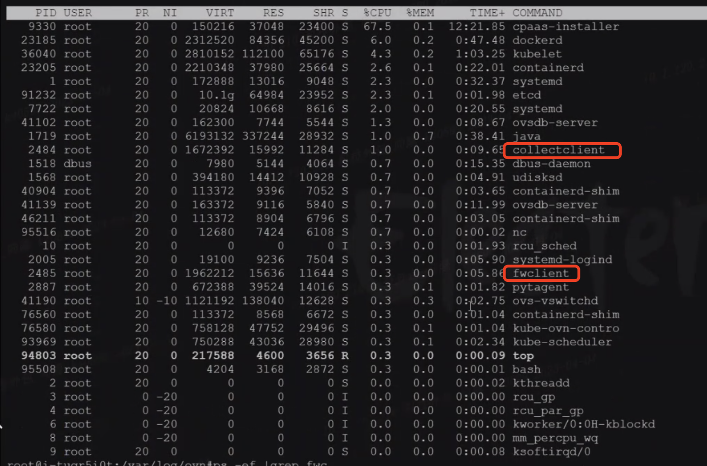
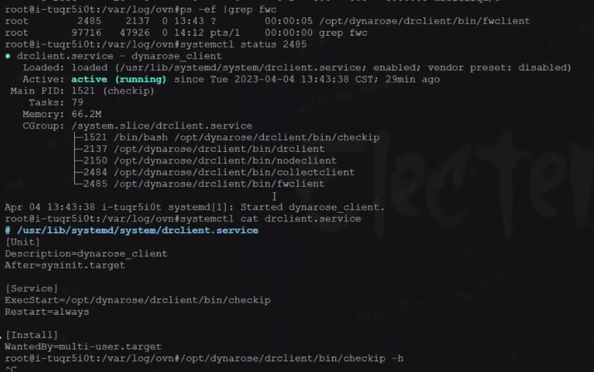
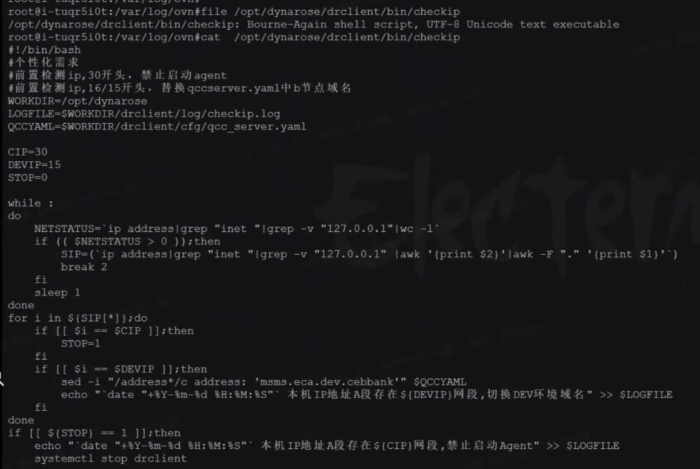
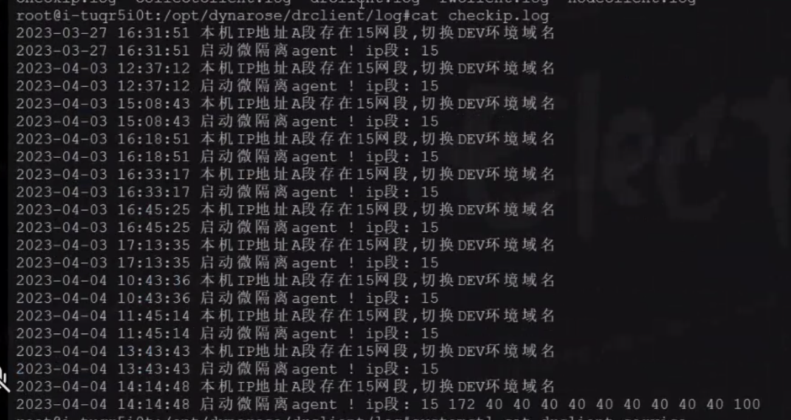
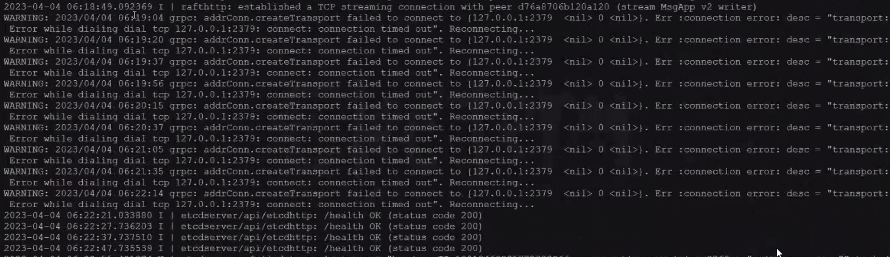

---
kind:
  - Troubleshooting
products:
  - Alauda Container Platform
  - Alauda DevOps
  - Alauda AI
  - Alauda Application Services
  - Alauda Service Mesh
  - Alauda Developer Portal
ProductsVersion:
  - 4.1.0,4.2.x
---
<!-- A type of document that involves encountering a fault, diagnosing it, performing root cause analysis, and providing solutions. -->

# etcd 报错：use of closed network connection

etcd 全部故障，节点间出现 use of closed network connection 报错 dial 127.0.0.1:2379 timed out 报错 ovn-central 健康检查在与 127.0.0.1 端口通信时失败

## Cause
- 系统中存在 drclient.service 服务，其关联的 fwclient 进程干扰了网络通信

## Resolution
- systemctl disable --now drclient.service

## [workaround]

## [Related Information]
**Screenshots**

- Environment: 麒麟 v10 x86，Kube-OVN v1.7，ACP v3.6.2
- 2379
- ovn-central
- drclient.service
- fwclient 进程
- Component: ETCD
- Page ID: 140833388
- Original Title: etcd 报错：use of closed network connection
