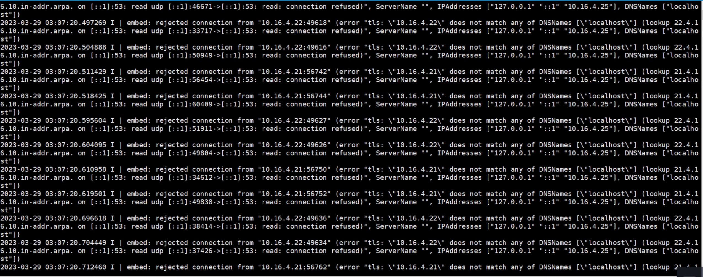

---
kind:
  - Troubleshooting
products:
  - Alauda Container Platform
  - Alauda DevOps
  - Alauda AI
  - Alauda Application Services
  - Alauda Service Mesh
  - Alauda Developer Portal
ProductsVersion:
  - 4.1.0,4.2.x
---
<!-- A type of document that involves encountering a fault, diagnosing it, performing root cause analysis, and providing solutions. -->

# etcd无法正常启动导致集群异常

etcd日志报证书异常 master3节点etcd日志反馈解析异常 master1、2节点etcd证书IP地址错误

## Cause
- master1、2节点错误使用master3节点的etcd证书

## Resolution
- 还原master1、2节点原始证书文件
- 重建etcd容器

## [workaround]

## [Related Information]
**Screenshots**
****

- Environment: 通用版本etcd环境
- etcd证书
- etcd容器
- master节点IP配置
- Component: ETCD
- Page ID: 140834574
- Original Title: etcd无法正常启动导致集群异常
