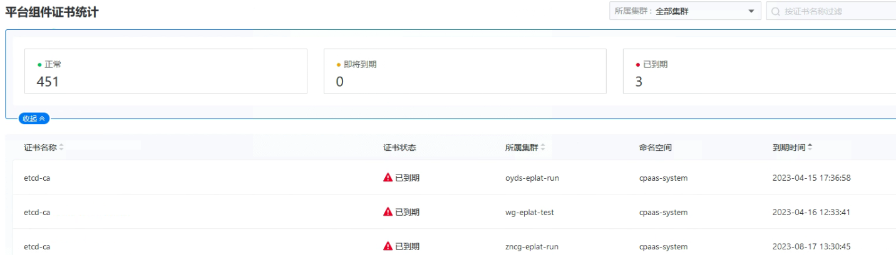

---
kind:
  - Troubleshooting
products:
  - Alauda Container Platform
  - Alauda DevOps
  - Alauda AI
  - Alauda Application Services
  - Alauda Service Mesh
  - Alauda Developer Portal
ProductsVersion:
  - 4.1.0,4.2.x
---
<!-- A type of document that involves encountering a fault, diagnosing it, performing root cause analysis, and providing solutions. -->

# 3.12

巡检发现etcd-ca证书过期 影响devops功能交互

## Cause
- etcd-ca证书过期

## Resolution
- 备份原有secret过期证书: kubectl get secrets -n cpaas-system etcd-ca -o yaml >> oldetcdca.yaml
- 删除旧证书: kubectl delete secrets -n cpaas-system etcd-ca
- 创建新证书: kubectl create secret tls etcd-ca --cert=/etc/kubernetes/pki/etcd/ca.crt --key=/etc/kubernetes/pki/etcd/ca.key -n cpaas-system

## [workaround]

## [Related Information]
**Screenshots**

- Environment: 3.12
- etcd-ca
- cpaas-system
- /etc/kubernetes/pki/etcd/ca.crt
- /etc/kubernetes/pki/etcd/ca.key
- Component: ETCD
- Page ID: 178228495
- Original Title: 3.12-巡检发现-etcd-ca证书过期
