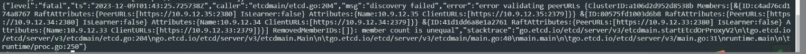
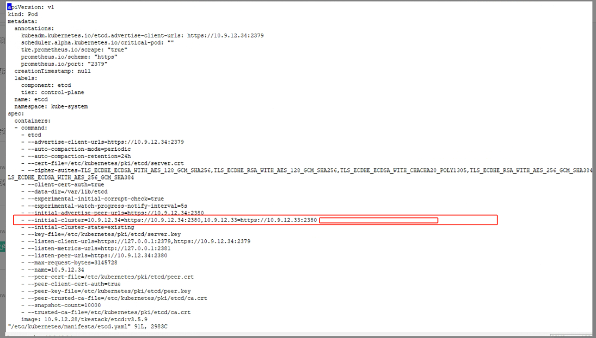

---
kind:
  - Troubleshooting
products:
  - Alauda Container Platform
  - Alauda DevOps
  - Alauda AI
  - Alauda Application Services
  - Alauda Service Mesh
  - Alauda Developer Portal
ProductsVersion:
  - 4.1.0,4.2.x
---
<!-- A type of document that involves encountering a fault, diagnosing it, performing root cause analysis, and providing solutions. -->

# 3.14

etcd无法启动 启动日志报peer相关集群配置异常

## Cause
- /etc/kubernetes/manifests/etcd.yaml中peer相关节点信息内容不全
- 历史手动操作etcd节点导致配置缺失

## Resolution
- 从正常节点获取缺失内容补充至etcd.yaml
- 手动触发apiservice重启

## [workaround]

## [Related Information]
**Screenshots**

- Environment: 3.14
- /etc/kubernetes/manifests/etcd.yaml
- etcd
- apiservice
- Component: ETCD
- Page ID: 178228545
- Original Title: 3.14-etcd异常无法启动报错peer相关集群配置异常
