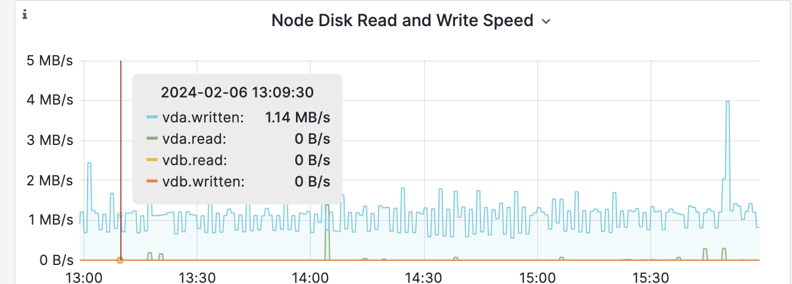

---
kind:
  - Troubleshooting
products:
  - Alauda Container Platform
  - Alauda DevOps
  - Alauda AI
  - Alauda Application Services
  - Alauda Service Mesh
  - Alauda Developer Portal
ProductsVersion:
  - 4.1.0,4.2.x
---
<!-- A type of document that involves encountering a fault, diagnosing it, performing root cause analysis, and providing solutions. -->

# etcd问题排查

etcd频繁切主 etcd dbsize过大导致空间打满，出现no space日志

## Cause
- 存在频繁更新的key
- 磁盘IO过高（超过1M/s）
- 节点间网络异常
- 存储IO不稳定
- 存在大量异常key
- kube-apiserver频繁重启导致压缩失败

## Resolution
- 使用etcdctl watch分析高频变更key
- 通过Grafana监控磁盘IO
- 使用scp测试节点间网络带宽
- 执行fio测试磁盘性能（fdatasync p99 <10ms）
- 调整quota-backend-bytes参数至8589934592
- 检查并清理异常key
- 确保kube-apiserver正常运行

## [workaround]
- 修改/etc/kubernetes/manifests/etcd.yaml增加--quota-backend-bytes参数
- 执行etcdctl alarm disarm解除警报

## [Related Information]
**Screenshots**

- Environment: etcd切主、etcd dbsize过大
- 2379
- /etc/kubernetes/pki/etcd/
- etcdctl
- fio
- kube-apiserver
- quota-backend-bytes
- Component: ETCD
- Page ID: 188712887
- Original Title: etcd问题排查
