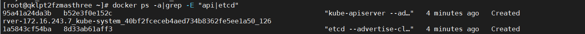
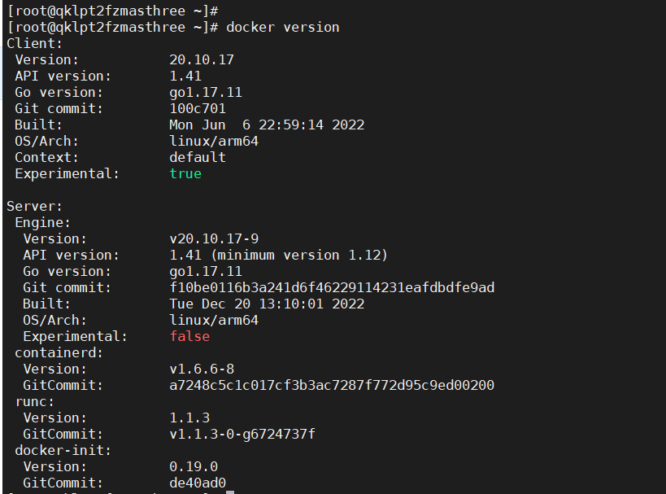
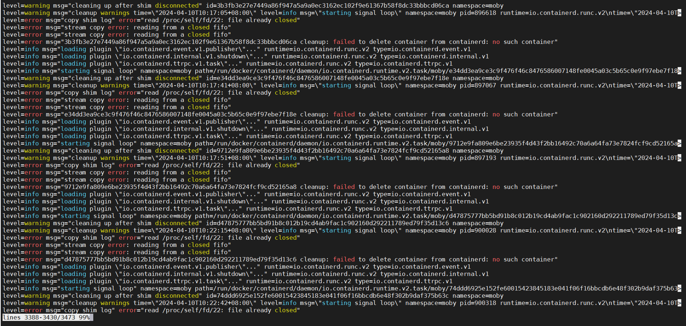
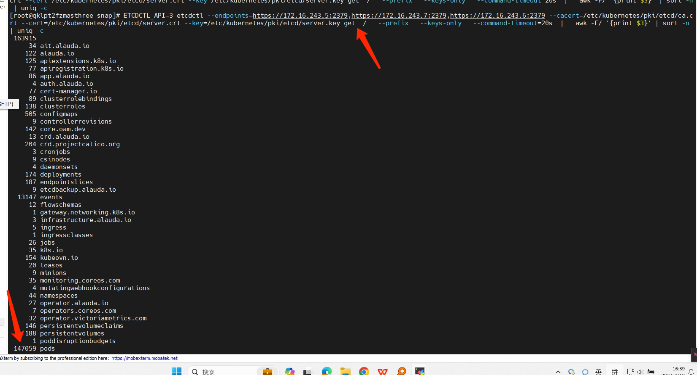
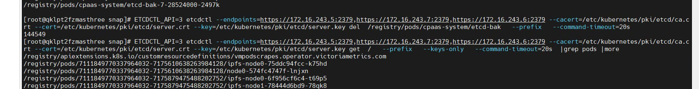

---
kind:
  - Troubleshooting
products:
  - Alauda Container Platform
  - Alauda DevOps
  - Alauda AI
  - Alauda Application Services
  - Alauda Service Mesh
  - Alauda Developer Portal
ProductsVersion:
  - 4.1.0,4.2.x
---
<!-- A type of document that involves encountering a fault, diagnosing it, performing root cause analysis, and providing solutions. -->

# master异常

docker报错stream copy error- reading from a closed fifo master服务器OOM并CPU飙升后无响应 集群中存在14w个etcd-bak的pod

## Cause
- etcd-bak任务异常导致大量pod堆积，集群算力不足

## Resolution
- 通过etcdctl命令直接删除pods数据
- 检查各节点磁盘占用情况和etcd备份配置

## [workaround]

## [Related Information]
**Screenshots**

- Environment: 3.10.2
- etcd-bak
- etcd集群
- etcdctl
- kubectl
- pod资源管理
- Component: ETCD
- Page ID: 201462414
- Original Title: 容器平台-master异常
