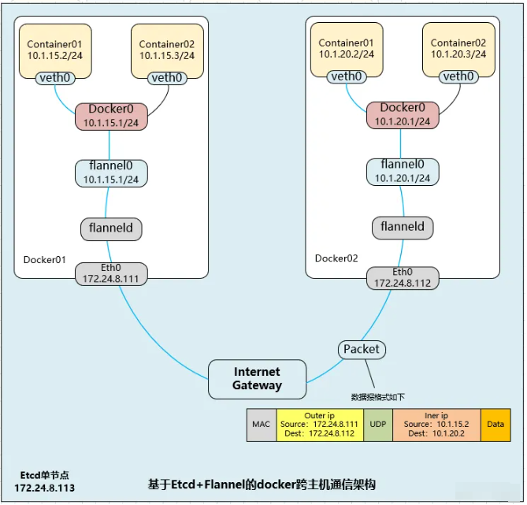

---
kind:
  - Troubleshooting
products:
  - Alauda Container Platform
  - Alauda DevOps
  - Alauda AI
  - Alauda Application Services
  - Alauda Service Mesh
  - Alauda Developer Portal
ProductsVersion:
  - 4.1.0,4.2.x
---
<!-- A type of document that involves encountering a fault, diagnosing it, performing root cause analysis, and providing solutions. -->

# 容器网络（Flannel ）

跨节点容器无法通信 子网分配失败 etcd 连接错误

## Cause
- etcd 配置错误
- 封装模式与底层网络不兼容
- 全局子网范围耗尽

## Resolution
- 检查 etcd 服务状态与配置
- 更换 VXLAN/host-gw/UDP 模式
- 调整全局 Network 配置范围

## [workaround]
- 重启 flanneld 进程
- 检查节点间 UDP 8472/VXLAN 端口连通性
- 手动清理 etcd 中旧子网记录

## [Related Information]
**Screenshots**

- Environment: Kubernetes 集群使用 Flannel 作为 CNI 插件
- etcd
- 8472/UDP
- /etc/cni/net.d/10-flannel.conflist
- Network
- SubnetLen
- Component: ETCD
- Page ID: 217547313
- Original Title: 容器网络（Flannel ）
