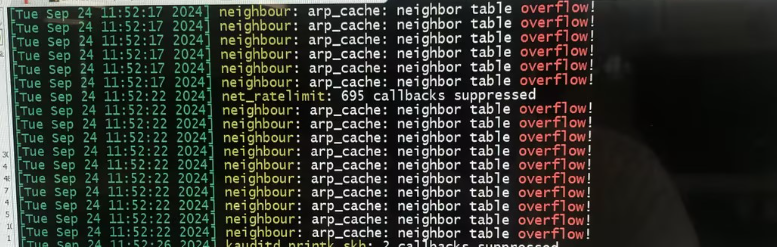
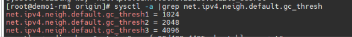

---
kind:
  - Troubleshooting
products:
  - Alauda Container Platform
  - Alauda DevOps
  - Alauda AI
  - Alauda Application Services
  - Alauda Service Mesh
  - Alauda Developer Portal
ProductsVersion:
  - 4.1.0,4.2.x
---
<!-- A type of document that involves encountering a fault, diagnosing it, performing root cause analysis, and providing solutions. -->

# underlay节点ovn

ovn-cni无法启动 dmesg日志报错'neighbour: arp_cache: neighbor table overflow'

## Cause
- 虚拟机邻居表大小限制参数设置不合理

## Resolution
- 修改/etc/sysctl.conf配置：
net.ipv4.neigh.default.gc_thresh1 = 1024
net.ipv4.neigh.default.gc_thresh2 = 2048
net.ipv4.neigh.default.gc_thresh3 = 4096
- 执行sysctl -p应用配置

## [workaround]

## [Related Information]
**Screenshots**

- Environment: Kube-OVN v1.12.14 (对应平台版本3.14.*/3.16.*/3.18.*)
- /proc/sys/net/ipv4/neigh/default/gc_thresh1
- /proc/sys/net/ipv4/neigh/default/gc_thresh2
- /proc/sys/net/ipv4/neigh/default/gc_thresh3
- /etc/sysctl.conf
- ovn-cni
- Component: ETCD
- Page ID: 237535350
- Original Title: underlay节点ovn-cni异常无法启动-arp表超限导致
