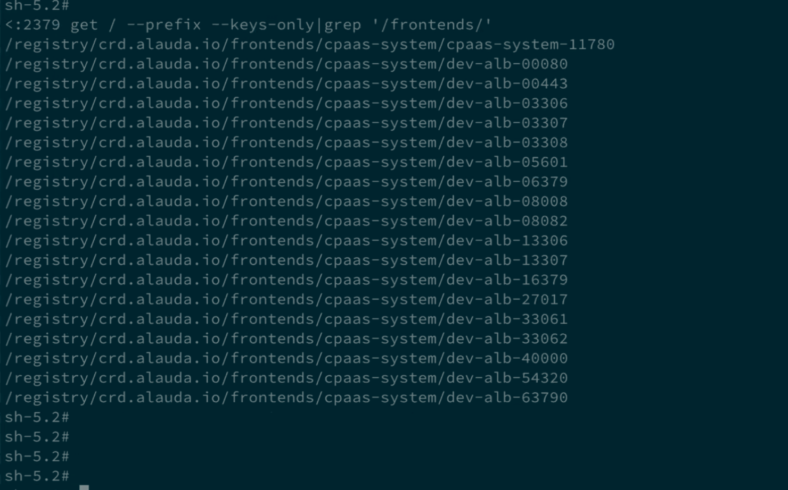
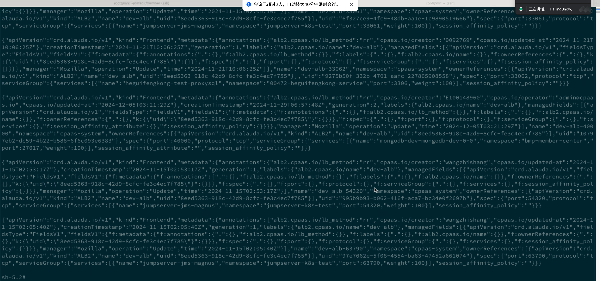
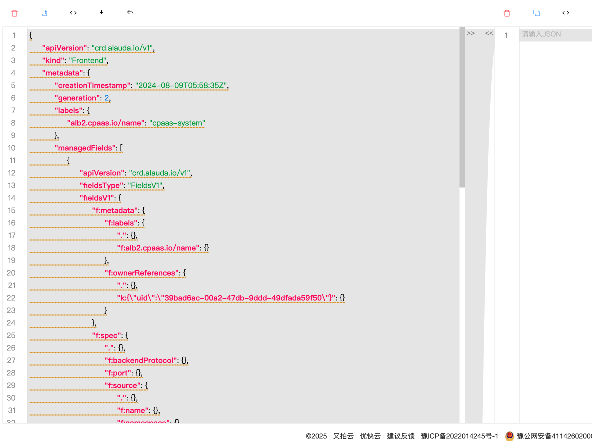
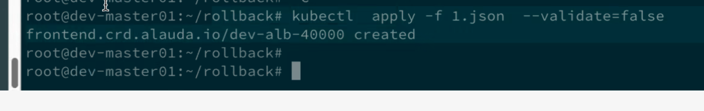

---
kind:
  - Troubleshooting
products:
  - Alauda Container Platform
  - Alauda DevOps
  - Alauda AI
  - Alauda Application Services
  - Alauda Service Mesh
  - Alauda Developer Portal
ProductsVersion:
  - 4.1.0,4.2.x
---
<!-- A type of document that involves encountering a fault, diagnosing it, performing root cause analysis, and providing solutions. -->

# AIT

ALB中配置的ft策略被误删除

## Cause
- 误操作导致ALB规则被删除

## Resolution
- 在master节点获取etcd镜像信息：crictl images |grep etcd
- 在node节点拉取etcd镜像：nerdctl pull etcd:3.15.x --insecure-registry
- 启动etcd容器：nerdctl run -it -host --name etcd-restore -v /root/etcd-restore-pipeline/datadir:/root/etcd x.x.x.x:60080/tkestack/etcd:v3.15.x etcd --listen-client-urls="http://0.0.0.0:2379" --advertise-client-urls="http://0.0.0.0:2379" --data-dir=/root/etcd
- 查询frontends key：etcdctl --endpoints=http://172.17.0.2:2379 get / --prefix --keys-only|grep '/frontends/'
- 获取frontend资源JSON：etcdctl --endpoints=http://10.4.0.2:2379 get /registry/crd.alauda.io/frontends/cpaas-system/$1 --print-value-only --prefix
- 拷贝JSON文件到本地：nerdctl cp xxxx:/backup.txt .
- 使用kubectl应用配置：kubectl apply -f xxx.json --validate=false

## [workaround]

## [Related Information]
**Screenshots**

- Environment: 通用版本
- /registry/crd.alauda.io/frontends/cpaas-system
- etcd
- kubectl
- ALB
- frontends资源
- Component: ETCD
- Page ID: 282231035
- Original Title: AIT-通过etcd备份文件查找被删除的ALB规则信息并还原
