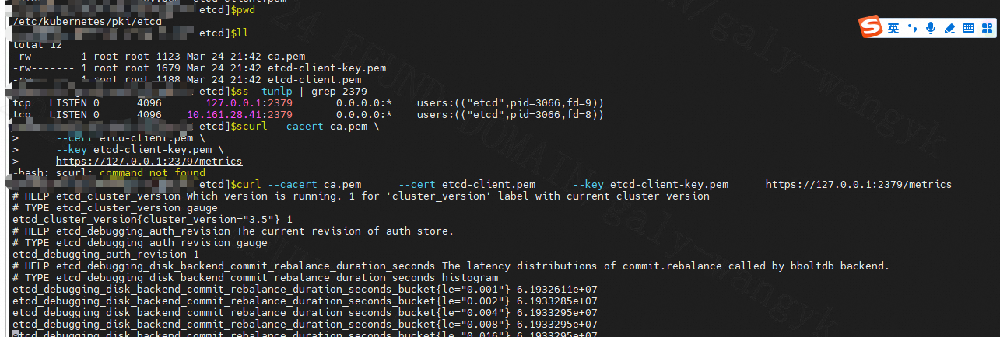

---
kind:
  - Troubleshooting
products:
  - Alauda Container Platform
  - Alauda DevOps
  - Alauda AI
  - Alauda Application Services
  - Alauda Service Mesh
  - Alauda Developer Portal
ProductsVersion:
  - 4.1.0,4.2.x
---
<!-- A type of document that involves encountering a fault, diagnosing it, performing root cause analysis, and providing solutions. -->

# systemd启动的etcd，暴露了metrics接口，请问怎么接入监控

etcd metrics接口需要接入监控

## Cause

## Resolution
- 确认metrics接口可访问(如curl http://etcd-server:2379/metrics)
- 检查systemd service文件确保已配置--listen-metrics-urls参数
- 配置Prometheus scrape job指向目标地址:2379/metrics

## [workaround]

## [Related Information]
**Screenshots**

- Environment: ACK集群 4.0.2版本
- 2379
- /metrics
- etcd.service
- --listen-metrics-urls
- Component: ETCD
- Page ID: 323682821
- Original Title: 基础架构-运维中心-监控告警通知巡检-systemd启动的etcd，暴露了metrics接口，请问怎么接入监控-113644
