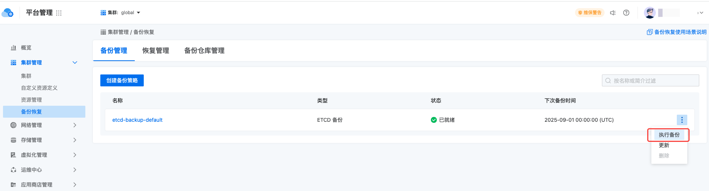

---
kind:
  - Troubleshooting
products:
  - Alauda Container Platform
  - Alauda DevOps
  - Alauda AI
  - Alauda Application Services
  - Alauda Service Mesh
  - Alauda Developer Portal
ProductsVersion:
  - 4.1.0,4.2.x
---
<!-- A type of document that involves encountering a fault, diagnosing it, performing root cause analysis, and providing solutions. -->

# 交换机重启，网络中断后，对云平台的影响？

节点和应用服务异常

## Cause
- 交换机重启导致全网中断

## Resolution
- 执行etcd数据备份
- 使用平台巡检功能检查恢复状态

## [workaround]

## [Related Information]
**Screenshots**

- Environment: 3.12.3
- etcd
- 巡检功能
- Component: ETCD
- Page ID: 327812227
- Original Title: 基础架构-交换机重启，网络中断后，对云平台的影响？-114622
