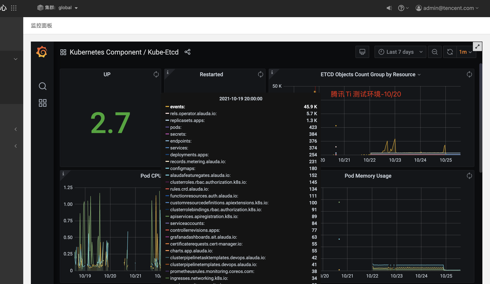

---
kind:
  - Troubleshooting
products:
  - Alauda Container Platform
  - Alauda DevOps
  - Alauda AI
  - Alauda Application Services
  - Alauda Service Mesh
  - Alauda Developer Portal
ProductsVersion:
  - 4.1.0,4.2.x
---
<!-- A type of document that involves encountering a fault, diagnosing it, performing root cause analysis, and providing solutions. -->

# 腾讯ETCD集群异常

频繁出现OOM etcd节点周期性失联（约5分钟） etcd数据量较大（1.3G）

## Cause
- etcd存储大量events数据（46K keys）
- 存在大量rels.operator.alauda.io相关数据（6K keys）
- 内存不足导致OOM

## Resolution
- 备份etcd数据
- 清理etcd events数据
- 清理base-operator和alauda-base相关key（保留每个apprelease编号最大的几个key）
- 执行etcd数据碎片压缩整理

## [workaround]

## [Related Information]
**Screenshots**

- Environment: 3.0.1
- etcd集群状态endpoint
- events资源
- apprelease保留策略
- base-operator/alauda-base组件
- Component: ETCD
- Page ID: 94894389
- Original Title: 腾讯ETCD集群异常
