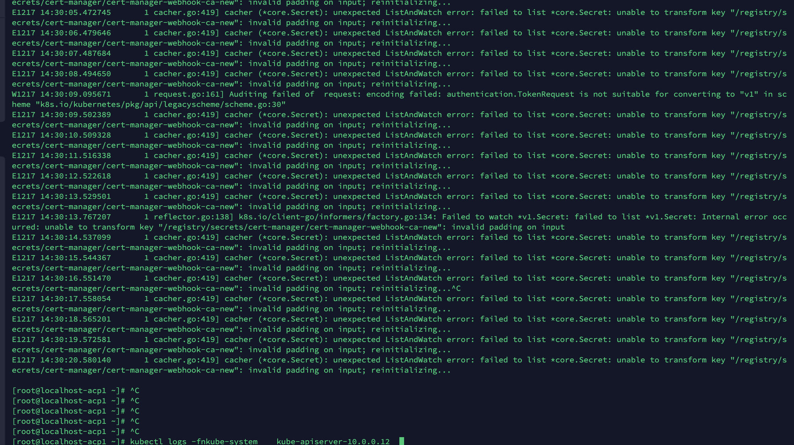

---
kind:
  - Troubleshooting
products:
  - Alauda Container Platform
  - Alauda DevOps
  - Alauda AI
  - Alauda Application Services
  - Alauda Service Mesh
  - Alauda Developer Portal
ProductsVersion:
  - 4.1.0,4.2.x
---
<!-- A type of document that involves encountering a fault, diagnosing it, performing root cause analysis, and providing solutions. -->

# secret资源无法被kube

kube-apiserver无法就绪 日志报错无法加载secret 删除报错secret/sa后问题依旧

## Cause
- master节点的/etc/kubernetes/encryption-provider.conf文件不一致

## Resolution
- 确保所有master节点的/etc/kubernetes/encryption-provider.conf文件内容一致
- 检查kube-apiserver.yaml配置是否包含--experimental-encryption-provider-config=/etc/kubernetes/encryption-provider.conf

## [workaround]

## [Related Information]
**Screenshots**

- Environment: 3 master节点的Kubernetes集群
- /etc/kubernetes/encryption-provider.conf
- --experimental-encryption-provider-config
- secret
- serviceaccount
- kube-controller-manager
- etcd
- Component: Kube-APIServer
- Page ID: 101651566
- Original Title: secret资源无法被kube-apiserver加载
