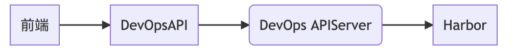
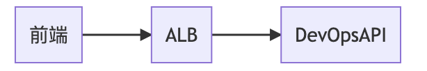
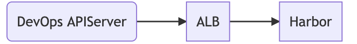

---
kind:
  - Troubleshooting
products:
  - Alauda Container Platform
  - Alauda DevOps
  - Alauda AI
  - Alauda Application Services
  - Alauda Service Mesh
  - Alauda Developer Portal
ProductsVersion:
  - 4.1.0,4.2.x
---
<!-- A type of document that involves encountering a fault, diagnosing it, performing root cause analysis, and providing solutions. -->

# 容器平台创建应用选择镜像后点击确定耗时长

创建应用选择镜像后跳转详情页耗时超过30s F12调试出现erebus接口请求错误

## Cause
- Harbor API响应慢
- 网络延迟(用户到ALB或ALB到Harbor)
- ALB/K8s APIServer处理延迟

## Resolution
- 通过ALB access.log定位慢请求：kubectl logs -f alb-pod-name-xx -n cpaas-system -c nginx --tail 100 | grep 镜像名称
- 调整devops-apiserver日志级别：设置DEBUG:"true"和--v=9参数
- 检查harbor集群ALB日志：kubectl logs -f alb-pod-name-xx -n cpaas-system -c nginx --tail 100 | grep 镜像名称

## [workaround]

## [Related Information]
**Screenshots**

- Environment: TKE 3.4, TKE 3.6
- Harbor API
- ALB
- K8s APIServer
- devops-apiserver
- erebus接口
- /v2/{project}/{repo}/manifests/{tag}
- /v2/{project}/{repo}/blobs/{sha256}
- Component: Kube-APIServer
- Page ID: 112065135
- Original Title: 容器平台创建应用选择镜像后点击确定耗时长
