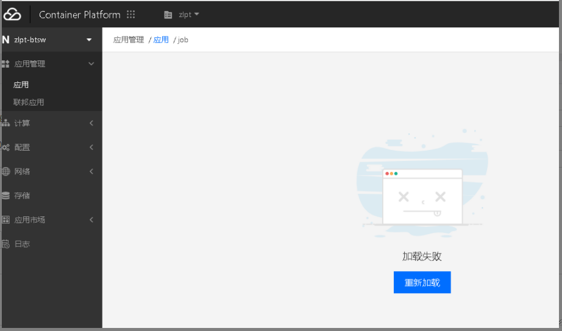

---
kind:
  - Troubleshooting
products:
  - Alauda Container Platform
  - Alauda DevOps
  - Alauda AI
  - Alauda Application Services
  - Alauda Service Mesh
  - Alauda Developer Portal
ProductsVersion:
  - 4.1.0,4.2.x
---
<!-- A type of document that involves encountering a fault, diagnosing it, performing root cause analysis, and providing solutions. -->

# 基础设施

应用页面偶现无法加载，刷新可以正常显示 部署应用点击主机选择器无法加载选择项 平台应用页面创建应用按钮偶现无权限

## Cause
- global集群erebus服务存在bug
- nginx-ingress-controller服务存在异常pod

## Resolution
- 重启异常的nginx-ingress-controller服务
- 升级平台版本到3.0

## [workaround]

## [Related Information]
**Screenshots**

- Environment: 2.9.*
- erebus
- nginx-ingress-controller
- Archon
- global集群
- Component: Kube-APIServer
- Page ID: 115511785
- Original Title: 基础设施-集群节点信息为空-界面部分按钮偶现提示无权限
