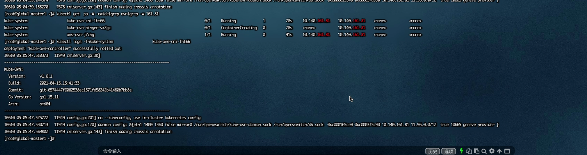
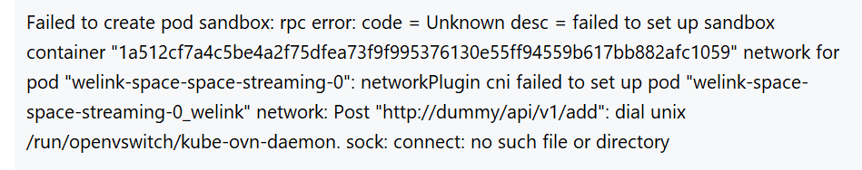
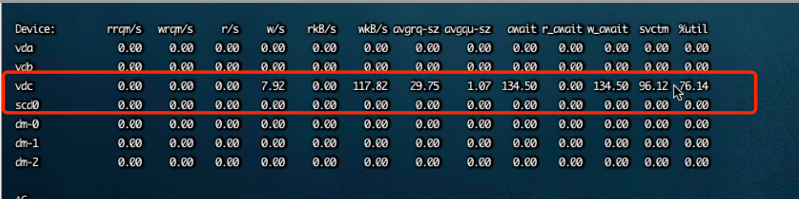

---
kind:
  - Troubleshooting
products:
  - Alauda Container Platform
  - Alauda DevOps
  - Alauda AI
  - Alauda Application Services
  - Alauda Service Mesh
  - Alauda Developer Portal
ProductsVersion:
  - 4.1.0,4.2.x
---
<!-- A type of document that involves encountering a fault, diagnosing it, performing root cause analysis, and providing solutions. -->

# ovn

ovn-cni持续crash状态 业务pod创建不出来 ovn-cni pod日志显示健康检查失败

## Cause
- ovn-cni启动脚本执行kubectl命令首次建立索引耗时过长
- 磁盘延迟高导致脚本执行缓慢
- 健康检查超时阈值设置不足

## Resolution
- 优化ovn-cni启动脚本执行效率
- 调整readinessProbe/livenessProbe的timeoutSeconds参数
- 排查磁盘I/O性能问题
- 检查节点CPU和内存资源使用情况

## [workaround]

## [Related Information]
**Screenshots**

- Environment: TKE 3.4以上
- ovn-cni
- kubectl
- readinessProbe
- livenessProbe
- /usr/local/bin/ovn-cni-init
- timeoutSeconds
- Component: Kube-APIServer
- Page ID: 119080391
- Original Title: ovn-cni探针失败持续crash
