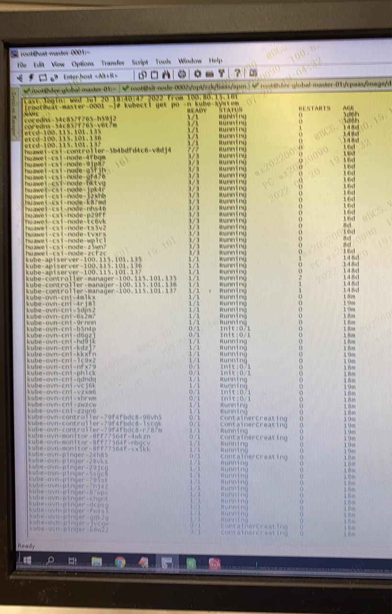

---
kind:
  - Troubleshooting
products:
  - Alauda Container Platform
  - Alauda DevOps
  - Alauda AI
  - Alauda Application Services
  - Alauda Service Mesh
  - Alauda Developer Portal
ProductsVersion:
  - 4.1.0,4.2.x
---
<!-- A type of document that involves encountering a fault, diagnosing it, performing root cause analysis, and providing solutions. -->

# pod token异常排查

Pod无法挂载token 事件中显示ServiceAccount UID不匹配 unattached volumes=[new-volume kube-api-access] timed out

## Cause
- ServiceAccount的UID与已存在的资源不匹配
- Kubernetes已知BUG（authentication.TokenRequest编码失败）
- 挂载PVC的Pod未正确释放导致后续Pod无法挂载

## Resolution
- 升级到已修复该BUG的Kubernetes版本
- 清理残留的Pod/PVC资源

## [workaround]

## [Related Information]
**Screenshots**

- Environment: 通用
- ServiceAccount
- kube-api-access
- PVC
- TokenRequest
- Component: Kube-APIServer
- Page ID: 120120705
- Original Title: pod token异常排查
