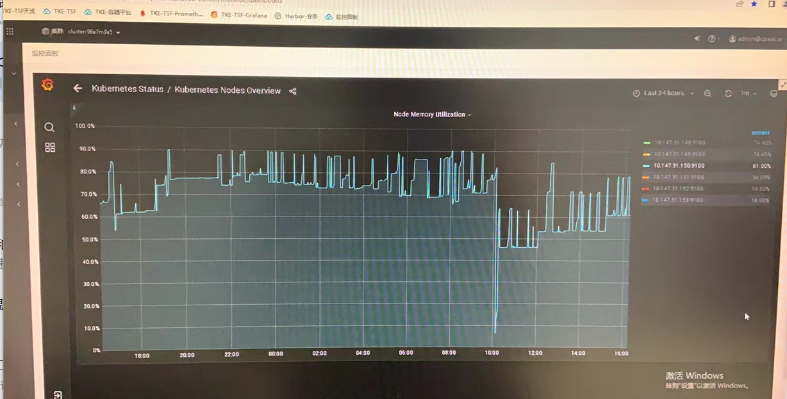
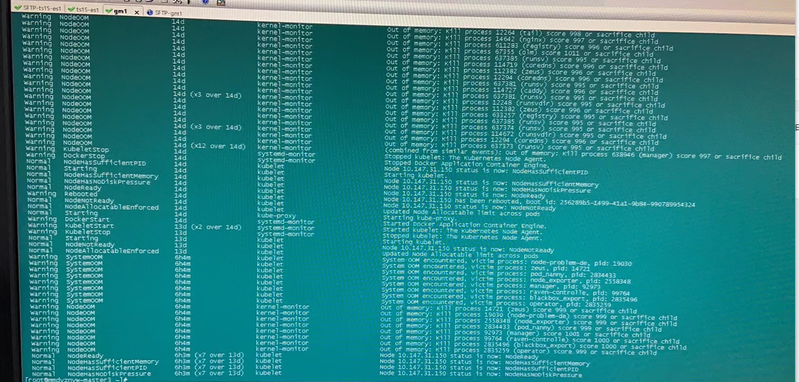
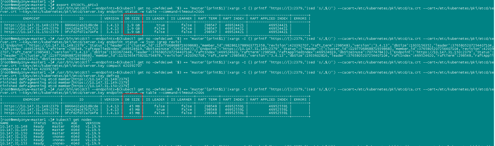

---
kind:
  - Troubleshooting
products:
  - Alauda Container Platform
  - Alauda DevOps
  - Alauda AI
  - Alauda Application Services
  - Alauda Service Mesh
  - Alauda Developer Portal
ProductsVersion:
  - 4.1.0,4.2.x
---
<!-- A type of document that involves encountering a fault, diagnosing it, performing root cause analysis, and providing solutions. -->

# global master节点内存异常

节点触发系统OOM导致prometheus pod被终止 kube-apiserver、etcd pod内存占用异常高 etcd数据量占用1.7G

## Cause
- events资源数据过多导致etcd内存占用过高

## Resolution
- 备份etcd数据
- 删除所有events数据: ETCDCTL_API=3 etcdctl --endpoints=https://192.168.15.146:2379,https://192.168.15.147:2379,https://192.168.15.148:2379 --cacert=/etc/kubernetes/pki/etcd/ca.crt --cert=/etc/kubernetes/pki/etcd/server.crt --key=/etc/kubernetes/pki/etcd/server.key del '/registry/events' --prefix
- 执行etcd碎片压缩整理

## [workaround]

## [Related Information]
**Screenshots**

- Environment: 通用
- etcd
- kube-apiserver
- prometheus
- 2379
- /etc/kubernetes/pki/etcd/
- /registry/events
- Component: Kube-APIServer
- Page ID: 127422728
- Original Title: global master节点内存异常
