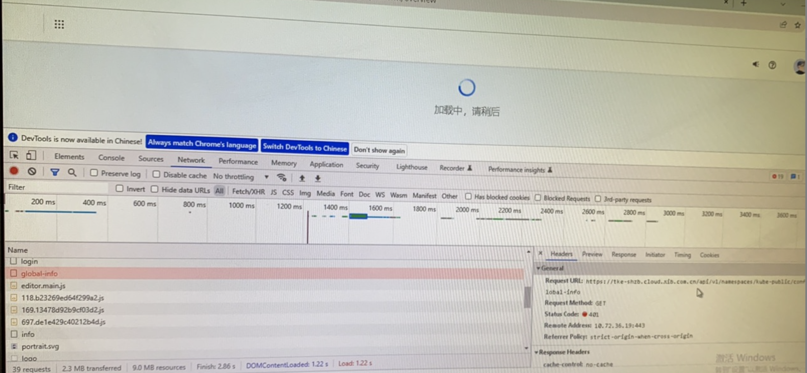
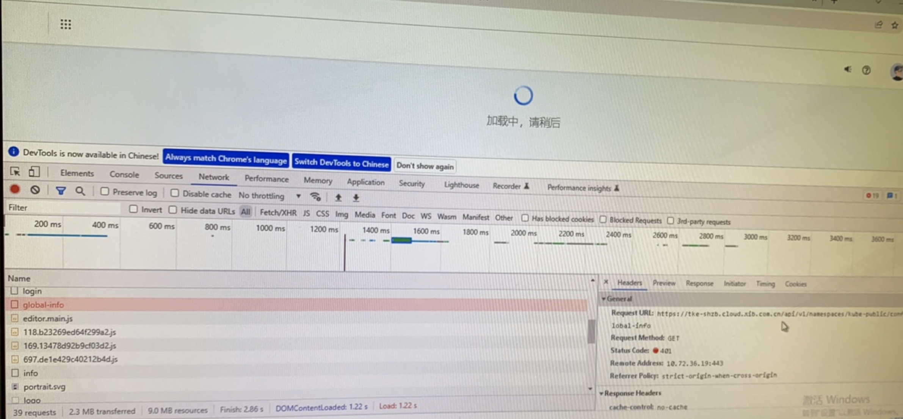
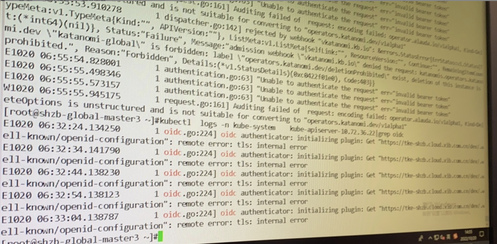
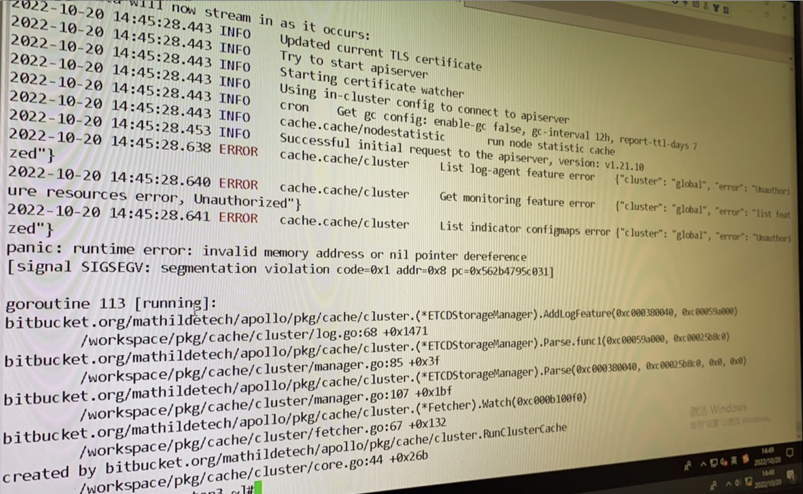

---
kind:
  - Troubleshooting
products:
  - Alauda Container Platform
  - Alauda DevOps
  - Alauda AI
  - Alauda Application Services
  - Alauda Service Mesh
  - Alauda Developer Portal
ProductsVersion:
  - 4.1.0,4.2.x
---
<!-- A type of document that involves encountering a fault, diagnosing it, performing root cause analysis, and providing solutions. -->

# global集群状态异常

页面无法加载报错401 Apollo组件日志异常

## Cause
- cc资源异常
- 认证配置异常

## Resolution
- 使用cluster-admin高权token重新生成cc资源

## [workaround]

## [Related Information]
**Screenshots**

- Environment: TKE 3.8.1
- apiserver
- oidc
- Apollo组件
- cc资源
- Component: Kube-APIServer
- Page ID: 133076129
- Original Title: global集群状态异常
