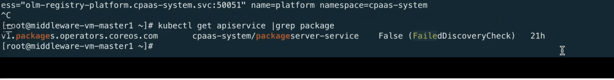

---
kind:
  - Troubleshooting
products:
  - Alauda Container Platform
  - Alauda DevOps
  - Alauda AI
  - Alauda Application Services
  - Alauda Service Mesh
  - Alauda Developer Portal
ProductsVersion:
  - 4.1.0,4.2.x
---
<!-- A type of document that involves encountering a fault, diagnosing it, performing root cause analysis, and providing solutions. -->

# 接入cce集群之后Operator列表为空

packagemanifest资源不存在 packageserver中报错 kubectl get apiservice|grep package发现package资源报错

## Cause
- kube-apiserver缺少requestHeader参数导致聚合层配置异常

## Resolution
- 在kube-apiserver.manifest添加--proxy-client-cert-file等3个requestHeader参数
- 逐个master节点修改/var/paas/kubernetes/manifests/kube-apiserver.manifest并重启kube-apiserver

## [workaround]

## [Related Information]
**Screenshots**

- Environment: TKE 3.8 (CCE集群)
- packagemanifest
- packageserver
- apiservice
- /var/paas/kubernetes/manifests/kube-apiserver.manifest
- --proxy-client-cert-file
- --proxy-client-key-file
- --requestheader-allowed-names
- Component: Kube-APIServer
- Page ID: 133076135
- Original Title: 接入cce集群之后Operator列表为空
