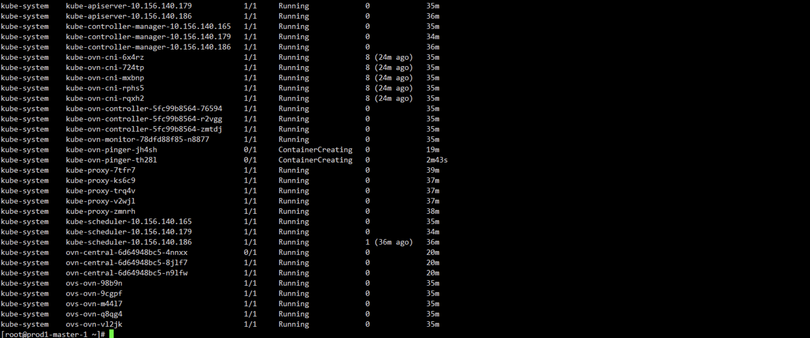
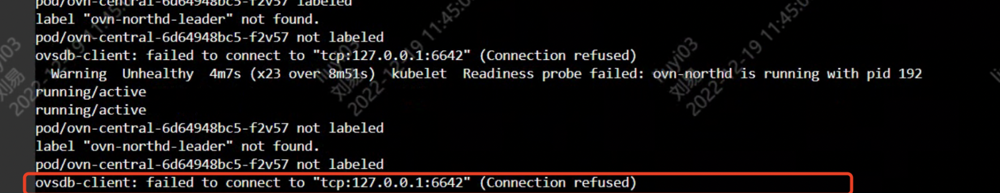
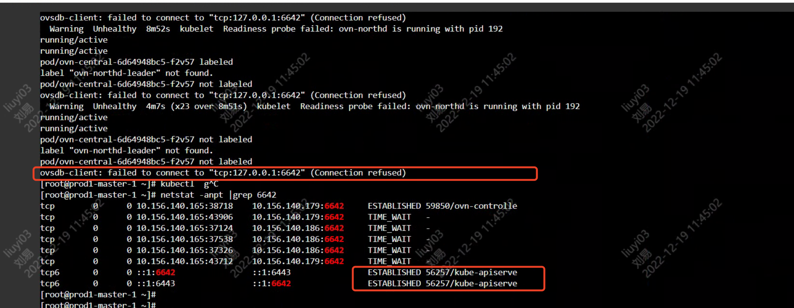

---
kind:
  - Troubleshooting
products:
  - Alauda Container Platform
  - Alauda DevOps
  - Alauda AI
  - Alauda Application Services
  - Alauda Service Mesh
  - Alauda Developer Portal
ProductsVersion:
  - 4.1.0,4.2.x
---
<!-- A type of document that involves encountering a fault, diagnosing it, performing root cause analysis, and providing solutions. -->

# 新建集群ovn

ovn-central无法启动 日志中存在连接127.0.0.1:6642失败的报错 netstat显示apiserver占用6642端口

## Cause
- apiserver进程通过随机端口占用6642端口导致端口冲突

## Resolution
- 重启apiserver释放端口占用
- 等待ovn-server重新监听6642端口

## [workaround]

## [Related Information]
**Screenshots**

- Environment: 3.10.1
- 6642端口
- ovn-server
- apiserver
- Component: Kube-APIServer
- Page ID: 133094406
- Original Title: 网络-新建集群ovn- central无法启动
