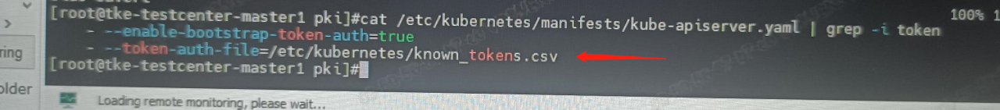

---
kind:
  - Troubleshooting
products:
  - Alauda Container Platform
  - Alauda DevOps
  - Alauda AI
  - Alauda Application Services
  - Alauda Service Mesh
  - Alauda Developer Portal
ProductsVersion:
  - 4.1.0,4.2.x
---
<!-- A type of document that involves encountering a fault, diagnosing it, performing root cause analysis, and providing solutions. -->

# 替换global

平台访问401

## Cause
- 新加节点apiserver的yaml中缺少配置

## Resolution
- 将配置加上并拷贝文件后恢复

## [workaround]

## [Related Information]
**Screenshots**

- Environment: 3.4.2
- apiserver.yaml
- Component: Kube-APIServer
- Page ID: 133095591
- Original Title: 替换global-master以后平台访问异常
