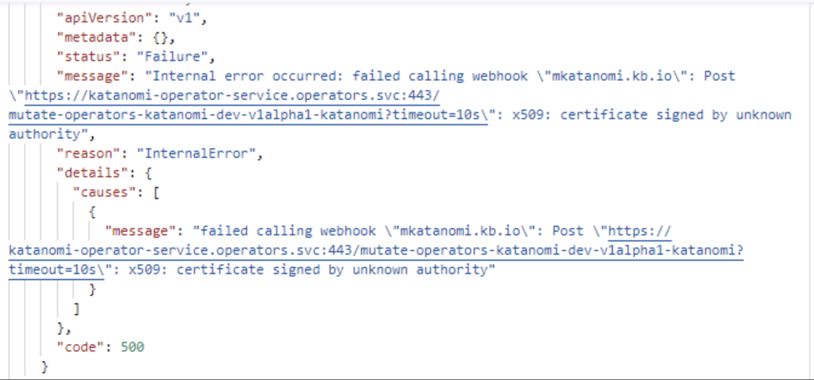
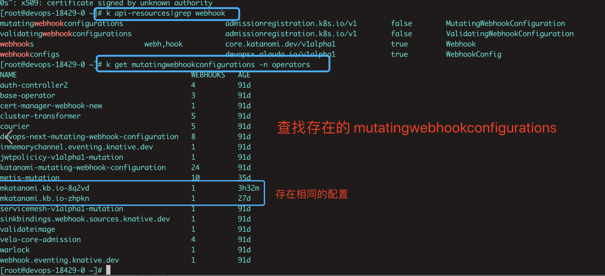

---
kind:
  - Troubleshooting
products:
  - Alauda Container Platform
  - Alauda DevOps
  - Alauda AI
  - Alauda Application Services
  - Alauda Service Mesh
  - Alauda Developer Portal
ProductsVersion:
  - 4.1.0,4.2.x
---
<!-- A type of document that involves encountering a fault, diagnosing it, performing root cause analysis, and providing solutions. -->

# katanomi实例创建失败

katanomi实例创建失败，错误信息：x509: certificate signed by unknown authority 存在两个相同的mutatingwebhookconfiguration资源

## Cause
- 存在重复的mutatingwebhookconfiguration导致kube-apiserver使用了不匹配的CA证书

## Resolution
- 执行命令检查资源：kubectl get mutatingwebhookconfigurations | grep katanomi
- 删除时间戳与当前部署不匹配的多余mutatingwebhookconfiguration
- 同样检查validatingwebhookconfigurations：kubectl get validatingwebhookconfigurations | grep katanomi

## [workaround]

## [Related Information]
**Screenshots**

- Environment: TKE 3.10.1
- mutatingwebhookconfigurations
- validatingwebhookconfigurations
- katanomi-operator-service.operators.svc:443
- caBundle
- Component: Kube-APIServer
- Page ID: 136534241
- Original Title: katanomi实例创建失败
