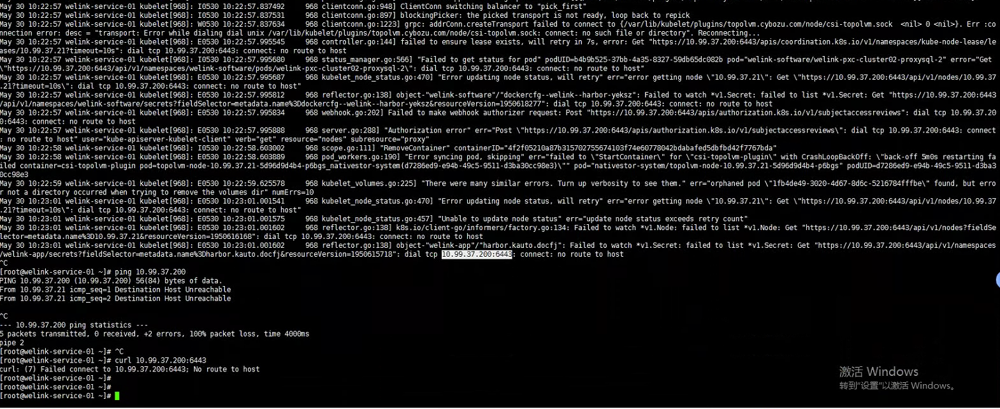
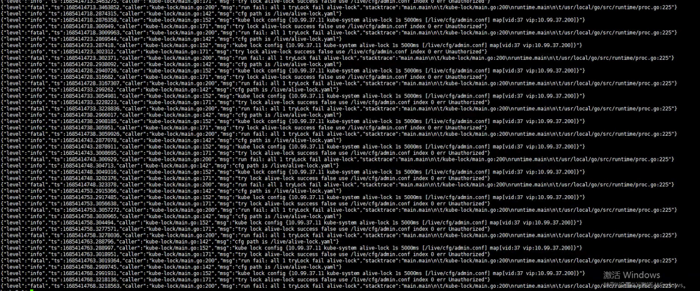
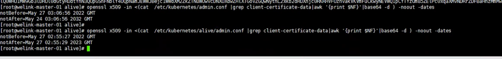

---
kind:
  - Troubleshooting
products:
  - Alauda Container Platform
  - Alauda DevOps
  - Alauda AI
  - Alauda Application Services
  - Alauda Service Mesh
  - Alauda Developer Portal
ProductsVersion:
  - 4.1.0,4.2.x
---
<!-- A type of document that involves encountering a fault, diagnosing it, performing root cause analysis, and providing solutions. -->

# 3.8.1业务集群自建vip证书过期修复

所有node节点全部故障无法连接apiserver alive容器日志出现Unauthorized字样 /etc/kubernetes/alive/admin.conf证书过期

## Cause
- 自建vip证书过期

## Resolution
- 使用/etc/kubernetes/admin.conf替换过期证书
- 执行sed命令替换vip和node ip
- 强制重建alive容器

## [workaround]
- mv /etc/kubernetes/alive/admin.conf /etc/kubernetes/alive-admin-bak.conf
- cp /etc/kubernetes/admin.conf /etc/kubernetes/alive/admin.conf
- docker ps -a|grep alive|awk '{print $1}'|xargs docker rm -f

## [Related Information]
**Screenshots**

- Environment: 3.8.1
- /etc/kubernetes/alive/admin.conf
- /etc/kubernetes/admin.conf
- alive容器
- vip配置
- Component: Kube-APIServer
- Page ID: 149590807
- Original Title: 3.8.1业务集群自建vip证书过期修复
